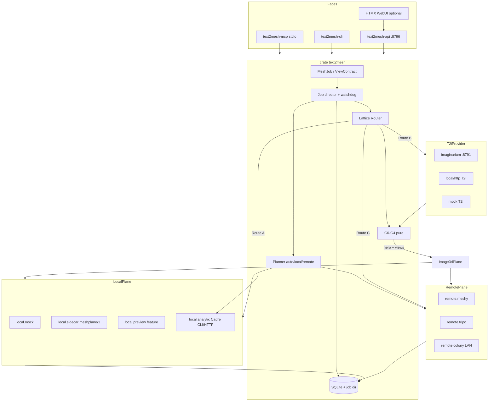
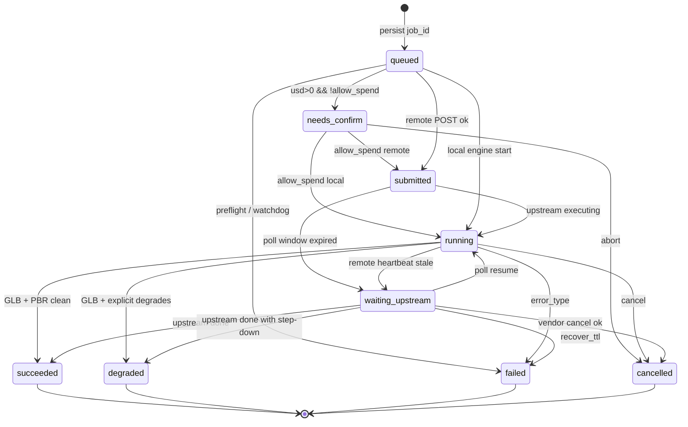
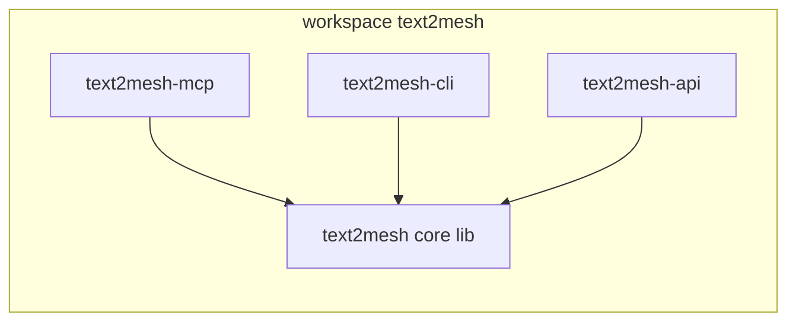
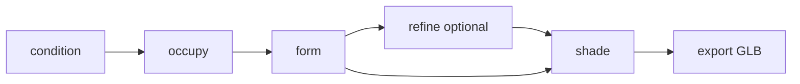

# text2mesh — Product Requirements Document

| Field | Value |
|---|---|
| **Status** | Draft v0.4 — **v1 (S0–S12) implemented 2026-08-19** on `main`. This file stays the product contract. |
| **Date** | 2026-08-19 |
| **Working name** | `text2mesh` (repo, crate prefix, binaries until D1 sweep PR) |
| **Garden name** | **Tessera-RS** (OQ-1 locked 2026-08-19) |
| **House** | Launchpad-RS |
| **Operator** | André (buckster123) |
| **Agent** | GROK |
| **Cerebro product id** | `TESSERA` (OQ-1; tags `project:text2mesh`) |
| **Contract twin** | `docs/design.md` (normative wire) · `docs/CHARTER.md` (binding D*) |

This document is the **product** contract. `docs/design.md` is the **implementation** contract. CHARTER D* win on conflict. **v1 (S0–S12) is on `main` as of 2026-08-19** (`docs/STATUS.md`). Nothing in this file is a port.

---

## 0. Clean-Room Methodology & Provenance

### 0.1 Method

This PRD is a **clean-room functional-conceptual equivalent** of a public *capability*: still image or text in, honest textured mesh (glTF 2.0 GLB) out, on local/onboard compute **or** a networked provider, behind one job schema.

Requirements restate **capabilities** advertised in public READMEs, papers, model cards, LICENSE files, and hosted-API docs. Section 11 **invents** an independent mechanism: original types, crate names, stage names, wire formats, file formats, and hosts.

**Consulted (allowed):** public README and architecture *overview* pages; papers; LICENSE/NOTICE; Hugging Face model cards; hosted-API public docs; Launchpad-RS house doctrine/stack; OmniOcular-RS / Cadre-RS CHARTERs; Imaginarium-RS architecture (compose surface only); DocSmith §0 + ToC (section *shape*, not requirements).

**Forbidden (do not open, copy, or paraphrase statement-level source):**

- `RobertBeckebans/AI_trellis2cpp` and upstream `rms80/trellis2cpp`
- Microsoft `TRELLIS` / `TRELLIS.2` Python trees
- Hunyuan3D, TripoSR, Meshy, Tripo implementation source
- Their C ABI (`t2_*`), private containers (`.t2mesh`, `.dinodata`, …), Go demo server, ggml graph layouts, sampler defaults, custom glTF extras, CLI/symbol names, architecture diagrams, or measured workarounds (chunk sizes, attention splits)

**Custody for implementers:** this PRD + `docs/design.md` + `docs/CHARTER.md` + public format specs (Khronos glTF 2.0, GGUF spec) + crates.io. **Do not read** the C++/Python reference trees. **Appendix B is writer provenance only — not an implementer bibliography.** Do not clone those GitHub trees; do not open `src/`. If a PR contains any item from the forbidden list, it is not clean-room.

**Depth:** public self-description, not black-box probing of a compiled binary. Product-judgment items are marked **[inferred]**.

### 0.2 Provenance of this draft

All five research notes were present and read, in this order, before writing:

| # | Path | Role |
|---|---|---|
| 1 | `docs/research/BRIEFING.md` | Orchestrator fact pack; house OQ-1..7 |
| 2 | `docs/research/image-to-3d.md` | Image→PBR-GLB functional bar |
| 3 | `docs/research/text2-layer.md` | Lattice Router + View Contract invention lock |
| 4 | `docs/research/compute-plane.md` | Dual `ComputePlane` + planner + spend |
| 5 | `docs/research/house-and-siblings.md` | Doctrine, four-face, ports, siblings |

No reference-project source was opened for this PRD.

### 0.3 Naming hygiene

| Ours | Deliberately not |
|---|---|
| `MeshJob`, `text2mesh.job.v1` | Their job objects / option structs |
| `ViewContract` `text2mesh.view_contract.v1` | Prompt-only T2I fire-and-forget |
| Stages `condition / occupy / form / refine / shade / export` | Their stage / flow / SLAT identifiers |
| Sidecar protocol `meshplane/1` | Their C ABI |
| Quality `preview \| standard \| high \| ultra` | Voxel exponents in the public API |
| Store `<job_id>/{job.json,manifest.json,artifact.glb}` | Their private mesh containers |
| Bind `127.0.0.1:8796` | Their demo ports |

Working product name stays **`text2mesh`**. Garden name locked **Tessera-RS** (OQ-1). Crate/binary rename waits for a crates.io + trademark sweep PR (D1). Cerebro product id **TESSERA**.

---

## 1. Summary

Ship a **standalone-first Rust product** that turns a still image **or** a text prompt into a **portable glTF 2.0 GLB with core PBR materials**, on **local/onboard** inference **or** a **networked** provider, behind **one `MeshJob` schema** shared by MCP, CLI, and HTTP. Image path: decode → hash the bytes we condition on → run an `Image3dPlane` (mock in CI, user sidecar for v1 quality, optional preview feature, horizon in-process engine) → export GLB + provenance sidecar. Text path is a **real invention**, not “call a T2I API”: the **Lattice Router** classifies the prompt (analytic CAD vs visual vs native), compiles a typed **View Contract** (subject lock, 6-view camera ring, lighting, negatives, seeds), synthesizes a **Hero-Orbit** (one hero T2I, then I2I-orbit, not N independent samples), **fail-closes** on measurable gates G0–G4, then hands surviving views to the **same** image plane. Dual compute is one `ComputePlane` trait with `LocalPlane` + `RemotePlane`; `auto` is a pure planner that probes weights/VRAM/licenses/keys and **states the degrade**. Spend is gated; jobs never stick on a nameless `pending`; missing key is `not_configured`, not a timeout. Default configure is MIT OR Apache-2.0 and **never** pulls Hunyuan community weights or GPL print-wrap. Nano `cargo build` / `cargo test --workspace` succeed with **no** heavy inference runtime.

---

## 2. Background & Problem

### 2.1 The job that does not exist in the garden

Cadre-RS owns **dimensioned CAD** (Starlark → B-rep → STEP/GLB). Imaginarium-RS owns **T2I/I2I** with key isolation. OmniOcular-RS can **visualize** a 3D file; it does not generate one. Prefrontal confirmed **no** existing garden generative-mesh project. Makers and agents still need: drop a photo of a mug, or type “a red fox in a yellow raincoat,” and get a mesh they can open in Blender.

Public 2026 capability exists in several forms (open image-to-3D quality class; hosted text-to-3D APIs; fast feedforward preview). Wrapping any one of them as *the product* would lock quality, license, and compute to a vendor and would skip the garden’s honesty/spend/standalone doctrine.

### 2.2 Why naive T2I → mesh is not enough

Microsoft’s TRELLIS v1 authors **publicly** recommend text-to-3D via a text-to-image model then an **image-conditioned** 3D model (data limits on native text-3D). That *direction* is sound. A fire-and-forget “generate one pretty picture, pipe it to 3D” is **not a product**:

- No inspectable camera/identity artifact a human or agent can edit and replay.
- Janus faces and identity drift land in the mesh; 3D spend is wasted.
- A `40 mm M3 bracket` becomes a hallucinated neural bracket instead of Cadre.
- Local sidecar vs Meshy vs a LAN sibling become three different APIs.

### 2.3 Constraints this house will not relax

Launchpad-RS: contract first; slices not marathons; no fake success; spend gated; Nano-first; four-face shape; MCP hand-rolled `2024-11-05`; dual MIT OR Apache-2.0; secrets as length/head; Cerebro optional.

Krackan is in the **UK**. Hunyuan 2.1 community license **excludes EU/UK/KR** (even *displaying outputs*). That is a default-vendor landmine, not a footnote.

---

## 3. Goals

**G1.** Image in → textured GLB out, importable in Blender and three.js, materials not silently dropped.

**G2.** Text in → inspectable View Contract + N consistent views → **same** GLB pipeline. Consistency beats naive independent T2I by a **stated numeric gate** (§7, §15).

**G3.** One `MeshJob` JSON round-trips a local mock engine **and** an HTTP mock provider in CI.

**G4.** `system-check` tells the truth: compiled features, probed devices, weight files + licenses, keys (length/head), sidecar handshake, sibling URLs, planner `would_pick` or degrade.

**G5.** MCP + CLI + HTTP share one schema generated from one Rust type layer (drift = CI fail).

**G6.** Dual path from v1: local/onboard **and** networked. Planner `auto` never fakes a pick.

**G7.** Standalone-first: zero siblings still work (mock T2I + mock 3D in CI; honest refuse otherwise).

**G8.** A job manifest records what **actually ran**: hashes, contract, engine, device, timings, licenses, spend, degrades.

**G9.** Nano default build: no ggml/CUDA/ONNX, no 14 GB pull, timeouts ≥ 30 s, never assume keys.

**G10.** License-clean defaults: no Hunyuan community weights, no GPL alpha-wrap in garden binaries.

---

## 4. Non-Goals

### 4.1 Permanent (v1 and the identity of the product)

| ID | Out | Why |
|---|---|---|
| **NG-P1** | CAD kernel / Starlark authoring / OCCT | Cadre-RS owns this. We compose or refuse. |
| **NG-P2** | Training / fine-tune / distillation | Puerperium-RS. Hunyuan §5.b would also block using their outputs as synthetic data. |
| **NG-P3** | Full DCC (Blender, sculpt, rig, animate) | We export a mesh. We do not become a DCC. |
| **NG-P4** | Wrapping a C++ port as the product | A user sidecar that speaks **`meshplane/1`** is an *engine*, not our identity. |
| **NG-P5** | Hunyuan community weights as default local engine | Territory + MAU + no-train-on-outputs. See §12. |
| **NG-P6** | Multi-tenant public SaaS | HTTP is loopback-default; non-loopback needs a token. |
| **NG-P7** | Stealing OmniOcular `visualize` | They render 3D files; we generate them. |
| **NG-P8** | Holding `XAI_API_KEY` | Imaginarium key isolation. INSTALLED ≠ ACTIVE. |
| **NG-P9** | Python/PyTorch as a runtime dependency | Test dumps only, if CHARTER later says so. |
| **NG-P10** | Linking `imaginarium-slint` (GPL) or Cadre OCCT | Sibling license problems stay in the sibling. |

### 4.2 Deferred (honest horizon, not v1)

| ID | Out of v1 | Revisit when |
|---|---|---|
| **NG-D1** | In-process 4B-class quality DiT | Horizon engine (OQ-2/OQ-3 locked). Sidecar is v1 quality. |
| **NG-D2** | Gaussian / NeRF as first-class artefacts | OQ-4 b locked. Not first-class; not a second success definition. Extra artefacts allowed beside the GLB if an engine emits them. Mesh+PBR GLB still defines success. |
| **NG-D3** | Animation, rigging, skinning, USD scenes | After GLB+PBR is boringly true. |
| **NG-D4** | Watertight 3D-print wrap | OQ-7 locked defer. GPL CGAL is not a garden default. |
| **NG-D5** | Native multi-image 3D engine as a second job type | View Contract already produces N views; consume them when an engine exists. |
| **NG-D6** | Native/Slint viewer | Compose OmniOcular/Cadre. Optional wgpu orbit in `-api` HTMX is enough if needed. |
| **NG-D7** | Streamable HTTP MCP | Stdio MCP is v1; REST is the HTTP face. |
| **NG-D8** | Underside cameras, unlocked per-view lighting | v2 View Contract research. |
| **NG-D9** | Burn tensor core | OQ-3 locked hybrid. Do not carry two tensor libs in v1. |
| **NG-D10** | Limen-RS / Quest spatial consume | Downstream. Out of v1. |

---

## 5. Personas

### 5.1 Human maker

Drops a product photo or types a creature prompt. Wants a GLB they can spin, download, and import. Will use CLI or the lean WebUI. Will not debug voxel grids. Needs honest “this is Preview, not a shipping asset” and a View Contract they can *see* (the six stills) before paying for 3D.

### 5.2 Agent harness

ApexOS-RS, Claude Code, Codex, Hermes, Grok Build — any MCP client. Calls `text2mesh_system_check`, `text2mesh_estimate`, then `text2mesh_submit` with `allow_spend` only after the estimate. Needs structured `error_type`, status/wait **split** (tools/list stays live), and **paths not megabyte blobs** on stdout. Never inherits a process-wide open spend gate by accident — prefer per-call `allow_spend`.

### 5.3 Colony node

A LAN sibling that *is* a `RemotePlane` (same `/v1/jobs` schema) or that *calls* us. Token on non-loopback bind. Not a special protocol. Callosum-RS is transport; we do not take port 8788.

### 5.4 Offline appliance

Pi-class Nano, air-gap workstation, or a box with weights on disk and no cloud keys. Default `cargo build` must work. CPU is allowed and **slow**. Missing T2I → Route B refuses. Missing Cadre → Route A refuses. Missing quality weights → Preview mock is **not** auto-selected unless `TEXT2MESH_ALLOW_MOCK=1`. `system-check` is the UI of truth.

---

## 6. Functional requirements — image-to-mesh

The image plane is the **shared 3D engine** for Route B. It is **single-image** in v1. Extra views from a View Contract are identity gates, texture refs, and future multi-image fuel — they do not fork this job type.

### 6.1 Input

| ID | Requirement |
|---|---|
| **FR-IMG-1** | Accept one still: **PNG or JPEG** (RGBA preferred). Optional WebP only if the decoder crate is already a garden dep. Reject video, PDF, and non-images with `spec.rejected` immediately — never a timeout. |
| **FR-IMG-2** | Server/CLI/MCP **mint** `job_id` (ULID). Callers do not invent persistence keys. Optional `idempotency_key` (string, ≤128) reuses an in-flight or completed job with the same key inside the store TTL. |
| **FR-IMG-3** | Preprocess is **ours**, pure, unit-tested: decode → optional alpha-aware crop/pad to square → write `input/original.bin` + `input/conditioned.png`. Hash **both** (SHA-256). Manifest records `image.hash_raw` and `image.hash_conditioned`. Condition on the conditioned bytes. |
| **FR-IMG-4** | Caps (frozen, design §20): **32 MiB compressed** upload; **4096** px long edge; **64 MiB** uncompressed decode buffer. Larger → `spec.rejected` with hint to resize. **No auto-scale in v1.** `image.scaled` is not used until a CHARTER amendment. |

### 6.2 Job knobs (public schema)

| ID | Requirement |
|---|---|
| **FR-IMG-5** | `quality` is one of `preview \| standard \| high \| ultra`. **Never** a raw voxel exponent in MCP/CLI/HTTP. Default for `auto` local: `preview` when `shared=true` or `vram_mb < 6144` or only preview weights; `standard` only if quality-stack disk ≥16 GiB **and** device VRAM ≥ **24576 MiB**; `ultra` is **never** selected by `auto`. |
| **FR-IMG-6** | `seed: u64 | null`. Omit → engine draws; **record the seed that actually ran**. Same seed + same conditioned hash + same engine version **should** be reproducible when the engine claims `deterministic=true`; mock **must** be. |
| **FR-IMG-7** | `compute.mode`: `auto \| local \| remote`. Optional `compute.prefer_device`: `cpu \| nvidia.cuda \| amd.rocm \| gpu.vulkan \| apple.metal`. Optional `compute.provider`: `local.mock \| local.sidecar \| local.preview \| remote.meshy \| remote.tripo \| remote.colony`. `auto` is a planner, not a vendor `#ifdef`. |
| **FR-IMG-8** | Export always produces `artifact.glb`. Optional flags (all default **off**): `keep_largest_component`, `force_opaque`, `unit_cube` (centre into a unit cube, +Y up, record the transform), `uv_atlas` (prefer UV+textures when the engine can bake). Destructive cleanup is **opt-in**. |
| **FR-IMG-9** | `print_wrap` default **false**. If true and no non-GPL wrap is available → `license.print_wrap_unavailable`, job `failed`. Never silently skip. |

### 6.3 Output — GLB + PBR

| ID | Requirement |
|---|---|
| **FR-IMG-10** | Artefact of record is **glTF 2.0 binary (.glb)** per Khronos. Triangle mesh, indexed primitives. Validate with the `gltf` crate (or equivalent) before `succeeded`/`degraded`. |
| **FR-IMG-11** | Target **core** metallic-roughness: base colour (`baseColorFactor` / `baseColorTexture` and/or `COLOR_0`), metallic + roughness (`metallicFactor` / `roughnessFactor` / packed `metallicRoughnessTexture` B/G), opacity via `alphaMode` `OPAQUE \| MASK \| BLEND`. Optional `normalTexture` with MikkTSpace tangents. Do **not** make a private vertex attribute the material contract. |
| **FR-IMG-12** | Prefer UV atlas + textures when the engine bakes. Vertex colour or factors-only is **always** `degraded` with `export.material_mode` set — **including preview and mock**. No preview exception. |
| **FR-IMG-13** | Default-only metallic-roughness factors (glTF defaults) with no `COLOR_0` variation and no textures → `failed` `export.materials_missing`. A grey untextured mesh is not a textured GLB. |
| **FR-IMG-14** | Alpha honesty: if an alpha map exists, either wire `BLEND`/`MASK` or set `force_opaque` and record it. Do not ship `OPAQUE` while claiming transparency. |
| **FR-IMG-15** | Do not label a raw mesh `printable` or `manifold` unless a wrap stage ran and reported success. Public quality cards admit small holes; we will too, in the manifest (`topology.watertight=false` by default). |
| **FR-IMG-16** | Sidecar `manifest.json` (same job dir) holds provenance (§13). The GLB must still be useful **without** the sidecar. Faces return a **path or content URL**, never multi-MB base64 on the MCP stdout. |
| **FR-IMG-17** | Mesh triangle/vertex counts are **diagnostics**, not pass/fail, not an accuracy metric. |

### 6.4 Quality tiers (product names)

Public systems advertise voxel-grid classes. **Those numbers are not our API.** A private engine map may exist inside a sidecar; it must not leak into public enums.

| Product | User-facing promise | Planner notes |
|---|---|---|
| `preview` | Seconds-class silhouette on GPU (minutes-class on CPU). “Is this the right object?” Not a shipping asset. | Local when preview weights present and (GPU ≥ 6144 MiB **or** CPU). Shared iGPU / `<6 GB` stops here. |
| `standard` | Full geometry + PBR. Default **local** pick **only** when quality-stack disk ≥16 GiB and device VRAM ≥ 24576 MiB. | Private engine maps stay inside the sidecar. |
| `high` | Refinement on top of standard when the engine + device can take it. | Same VRAM floor as standard until field truth amends CHARTER. |
| `ultra` | Explicit opt-in maximum. Slow, memory-heavy. **Never** `auto`. | Requested vs achieved both recorded. |

| ID | Requirement |
|---|---|
| **FR-IMG-18** | Planner `auto` quality: Preview if only preview weights **or** shared iGPU / `vram_mb < 6144`; Standard only at the §8.8 floors; High when weights + VRAM headroom **and** user asked high; **never Ultra**. |
| **FR-IMG-19** | If the user asked `high`/`ultra` and the engine steps down, status is **`degraded`** with `requested_quality` / `achieved_quality`. `local`/`remote` modes **never** silently change quality (fail instead). |

**Latency:** we publish **our** times in `system-check` per device. Do not copy vendor H100 or 16 GB card timings into planner defaults. CPU quality is **hours-class** until field truth says otherwise; never labelled interactive. Krackan (512 MiB shared AMD iGPU) is **remote or degrade** for quality.

### 6.5 Stages we own (isolation)

| ID | Requirement |
|---|---|
| **FR-IMG-20** | Stage ids `condition / occupy / form / refine / shade / export` are **manifest / meshplane progress names**. In-process implementations of those stages are **horizon** (D28), not S0–S11. Each progress event records `timings_ms[stage]` when the engine emits it. |

| Stage id | Does |
|---|---|
| `condition` | Image → vision tokens / encoder embedding. |
| `occupy` | Coarse “where is there material.” |
| `form` | Fields on occupied cells → extractable geometry. |
| `refine` | Optional High/Ultra cascade. |
| `shade` | PBR maps from image + shape. |
| `export` | Mesh + materials → GLB + sidecar. |

Mock engine may collapse to `export` only; the **names** still appear in the manifest (`stages_skipped`).

**FR-IMG-21.** Horizon only: if an in-process engine ever exists, its on-disk artefacts use a layout **we** document. We do not adopt reference container names. v1 sidecar may ignore unused stage ids.

### 6.6 Image-path honesty

| ID | Requirement |
|---|---|
| **FR-IMG-22** | Distinct errors: missing weights, missing sidecar, CPU-only vs requested GPU, license-blocked encoder, OOM (`engine.oom`), user cancel, remote 4xx/5xx. See §10 / design.md error table. |
| **FR-IMG-23** | Idle unload **[inferred]**: API/MCP process starts **without** allocating model VRAM; load on first local job; release when the queue is idle for `TEXT2MESH_IDLE_UNLOAD_S` (default 120). Sidecar child is killed, not leaked. |

---

## 7. Functional requirements — text2 layer (the invention)

The text path is **Lattice Router + typed View Contract + Hero-Orbit consistency loop**. It is not “call Flux then a 3D API.” It feeds the **same** `Image3dPlane` as §6.

Three routes, **one `MeshJob`**:

```
                 prompt + MeshJob
                        │
                 Lattice Router
                        │
       ┌────────────────┼────────────────┐
       ▼                ▼                ▼
  Route A          Route B            Route C
  Analytic        View Contract      Native text-3D
  (Cadre)         + Hero-Orbit       (opt-in provider)
                  → Image3dPlane
```

### 7.1 Why this is an invention

| Property | Naive T2I→3D | Lattice |
|---|---|---|
| Artifact | Prompt string | Typed JSON, schema id, JCS hash, editable cameras |
| Synthesis | N lucky independent samples (usually 1) | Hero lock, then I2I-orbit with the hero as reference |
| Quality | Hope | G0–G4 numeric gates, retry ladder, fail-closed before 3D spend |
| Prompt class | Everything is a pretty picture | Analytic CAD vs creature vs product; siblings composed |
| Compute | Vendor-shaped | Same `MeshJob` on local sidecar or remote adapter |

### 7.2 Lattice Router

| ID | Requirement |
|---|---|
| **FR-TXT-1** | `LatticeRouter::classify(prompt) -> PromptClass` is a **pure function**, no network, no LLM required in v1. Unit-tested against a fixture table. |
| **FR-TXT-2** | Job field `route`: `auto \| analytic \| view_contract \| native`. Default `auto`. |
| **FR-TXT-3** | `analytic` **never** silently falls through to a neural mesh. Missing Cadre → `analytic.unavailable`. Out of grammar → `analytic.too_complex`. Neural CAD requires explicit `route=view_contract` or `allow_neural_cad=true` (non-default). |

**Prompt classes and default routes:**

| Class | Signals (examples, not exhaustive) | Default route |
|---|---|---|
| `analytic` | `\b\d+(\.\d+)?\s*(mm\|cm\|m\|in\|inch)\b`, `M[2-9]\d?`, fillet/chamfer/extrude/bore/through-hole, “STEP”, “ISO 2768”, bracket/flange/standoff **with dimensions** | **A** |
| `creature` / `character` | animal, person, monster, “wearing”, named species | **B** |
| `product` | photo-like object, “product shot”, consumer goods without mm | **B** |
| `vehicle` / `architecture` / `prop` | as named | **B** |
| `unknown` | | **B** |

Mixed prompts (“steampunk clock, 40 mm diameter”) stay **B** unless CAD tokens dominate **and** the user did not ask for a creature.

### 7.3 Route A — Analytic (Cadre)

| ID | Requirement |
|---|---|
| **FR-TXT-4** | v1 grammar (closed, testable): primitives `box \| cylinder \| tube` with millimetre dimensions; through-holes `M3`–`M6` clearance from a **table we copy as numbers into our fixtures** (Cadre doctrine table as *public compose*, not a crate dep); simple linear patterns; optional fillet radius. |
| **FR-TXT-5** | Compiler emits **Starlark source from our templates** + calls Cadre via **CLI or HTTP** (`build` → `export --format glb`, STEP as honest primary). `write_source` over Cadre stdio is **off** by default; we do not flip that flag for the user. |
| **FR-TXT-6** | If neither `cadre` binary nor `TEXT2MESH_CADRE_URL` is live → refuse `analytic.unavailable` with hint. We do not link OCCT. |
| **FR-TXT-7** | Frame: Cadre is +Z up, millimetres. Manifest `frame=cadre_z_up_mm`. glTF is Y-up — record the transform if we re-wrap; prefer Cadre’s own GLB. |

### 7.4 View Contract — typed fields (normative)

Schema id: **`text2mesh.view_contract.v1`**. JSON, pretty-printable. Hash = SHA-256 over **JCS (RFC 8785)** canonicalization (if the crate is painful, document an equivalent: UTF-8, sorted keys, no insignificant whitespace — freeze in design.md). Hash lives on the `MeshJob` as `contract_hash`.

| ID | Requirement |
|---|---|
| **FR-TXT-8** | Compiler `compile_view_contract(prompt, quality, seed_policy) -> ViewContract` is **pure**, deterministic, unit-tested. No network. Optional later LLM rewrite of `identity_phrase` must be off by default; compiler works without it. |
| **FR-TXT-9** | `prompt.raw` is immutable once compiled. Edits clone a new `contract_id` (ULID). |
| **FR-TXT-10** | Every contract includes `compile_notes` (human/agent readable). Required. |

**Normative fields** (see also design.md §2 and Appendix A):

```json
{
  "schema": "text2mesh.view_contract.v1",
  "contract_id": "01JEXAMPLEULID000000000000",
  "created_at": "2026-08-19T12:00:00Z",
  "prompt": {
    "raw": "a red fox wearing a yellow raincoat",
    "normalized": "a red fox wearing a yellow raincoat",
    "hash": "sha256:…",
    "language": "en"
  },
  "subject_lock": {
    "identity_phrase": "a red fox wearing a yellow raincoat",
    "class": "creature",
    "attributes": [],
    "canonical_view_id": "hero"
  },
  "camera_ring": {
    "preset": "cardinal4_hero_top",
    "count": 6,
    "convention": "y_up_azimuth_from_front",
    "distance": 1.6,
    "fov_deg": 35,
    "cameras": [
      {
        "id": "hero",
        "role": "hero",
        "azimuth_deg": 35,
        "elevation_deg": 22,
        "roll_deg": 0,
        "required": true,
        "prompt_suffix": "three-quarter view from the front-right"
      }
    ]
  },
  "lighting": {
    "rig": "overcast",
    "locked": true,
    "key_azimuth_deg": -30,
    "fill_ratio": 0.4,
    "white_balance": "D65",
    "prompt_lock": "even overcast studio lighting, no hard shadows"
  },
  "background": {
    "mode": "neutral_gray",
    "hex": "#B4B4B4",
    "alpha_preferred": true,
    "prompt_lock": "plain neutral gray background"
  },
  "style_lock": {
    "medium": "photoreal",
    "albedo_bias": false,
    "prompt_lock": "photoreal product photography, single subject"
  },
  "negatives": [
    "second face",
    "face on the back of the head",
    "two faces",
    "duplicate head",
    "extra limbs",
    "cropped limbs",
    "text",
    "watermark",
    "multiple subjects",
    "logo"
  ],
  "seed_policy": {
    "family_seed": 42,
    "hero_seed": 42,
    "orbit_seed_mode": "family_plus_view_index"
  },
  "frame": { "width": 1024, "height": 1024, "aspect": "1:1" },
  "t2i": {
    "provider": "imaginarium",
    "model": "grok-imagine-image-2.0",
    "quality_tier": "preview"
  },
  "compile_notes": "class=creature; ring=cardinal4_hero_top; lighting=overcast; canonical=hero"
}
```

*Abridged: `cameras[1:]` omitted; full preset tables with frozen `prompt_suffix` are design §4.3. Class `prompt_lock` / `medium` / `negatives[]` are design §4.1. Compiler algorithms (identity, normalize, class, G3/G4) are design §4.1 / §6 — do not invent a POS tagger. S5 goldens are a function of those tables.*

**Field rules:**

| Field | Rule |
|---|---|
| `subject_lock.identity_phrase` | Camera-stripped remainder of `normalized` (design §4.1). Injected into every view prompt. |
| `subject_lock.attributes` | v1 always `[]`. |
| `prompt.language` | Always `"en"` in v1; no detector. |
| `subject_lock.class` | Drives **which gates run** (Janus = creature/character only). `character` iff humanoid tokens; else `creature` on species list. |
| `camera_ring.cameras[].required` | Failed *required* camera fails the job after retries. Optional cameras may drop (fail-down). |
| `lighting.locked` | Always `true` in v1. |
| `background.mode` | `neutral_gray` default. `alpha` is best-effort; G3 degrades rather than fakes alpha. |
| `style_lock.albedo_bias` | Default false. When true, prompt asks unlit/clay/albedo. |
| `t2i.provider` | Name of a `T2iProvider` impl, not a URL with a key. |
| `lighting.prompt_lock`, `background.prompt_lock`, `style_lock.medium`, `style_lock.prompt_lock`, `negatives[]` | Frozen by class — design §4.1 class lock table. Creature/character use the Janus negatives JSON array. Other classes use the non-Janus array. |
| `cameras[].prompt_suffix` | Frozen per camera id — design §4.3 and PRD §7.5. |

**Per-view prompt assembly (pure):**

```
{identity_phrase}, {style_lock.prompt_lock}, {background.prompt_lock},
{lighting.prompt_lock}, {camera.prompt_suffix},
azimuth {azimuth_deg} degrees, elevation {elevation_deg} degrees,
full subject in frame, same design as the reference
NEGATIVE: {negatives}
```

Hero T2I omits “same design as the reference.” Orbit I2I includes it and passes the hero (optionally nearest successful neighbor) as edit sources (≤3 — Imagine cap).

### 7.5 Camera ring

Convention **`y_up_azimuth_from_front`**: right-handed, **+Y up**, subject at origin facing **+Z** (glTF-style front). Camera on a sphere of radius `distance` (default **1.6**). `azimuth_deg` about +Y, 0 = front. `elevation_deg` from XZ, 90 = top. `fov_deg` default **35**. `roll_deg` = 0 in v1.

This is **not** Cadre’s +Z-up millimetre frame. Conversion is explicit at the analytic boundary.

**FR-TXT-11.** Presets (default locked OQ-5 = **6** `cardinal4_hero_top`):

**Nano 4 — `cardinal4`** (cheap, Tripo-named slots). Preview `cardinal4` has **no** `hero`; `canonical_view_id=front`. Suffixes frozen exact (design §4.3):

| id | az | el | required | role | prompt_suffix |
|---|---|---|---|---|---|
| front | 0 | 15 | yes | identity fallback, Tripo `front` | front view, camera on +Z |
| right | 90 | 15 | yes | Tripo `right` | right side view |
| back | 180 | 15 | yes | Janus witness, Tripo `back` | back view, camera on -Z |
| left | 270 | 15 | yes | Tripo `left` | left side view |

**Default 6 — `cardinal4_hero_top`:**

| id | az | el | required | role | prompt_suffix |
|---|---|---|---|---|---|
| hero | 35 | 22 | yes | identity lock, single-image 3D primary | three-quarter view from the front-right |
| front | 0 | 15 | yes | Tripo `front` | front view, camera on +Z |
| right | 90 | 15 | yes | | right side view |
| back | 180 | 15 | yes | Janus witness | back view, camera on -Z |
| left | 270 | 15 | yes | | left side view |
| top | 0 | 75 | **no** | polar; droppable | top-down view |

**Quality 8 — `cardinal4_hero_top_quarters`:** default 6 plus:

| id | az | el | required | role | prompt_suffix |
|---|---|---|---|---|---|
| qne | 45 | 18 | no | optional quarter | three-quarter view from the front-right, slightly higher |
| qnw | 315 | 18 | no | optional quarter | three-quarter view from the front-left, slightly higher |

Quality tier → preset: Preview/Nano → 4; Standard → 6; High/Ultra → 8. Job may override `camera_preset`. Underside cameras are **out of v1 default**.

Why 6: 4 matches Tripo but misses a 3/4 hero and the top; 8 grows I2I spend and drift; 6 feeds single-image 3D (hero), Tripo multiview (named cardinals), Meshy multi-image, and the eval pack.

### 7.6 Hero-Orbit loop

| ID | Requirement |
|---|---|
| **FR-TXT-12** | Independent N-view T2I is permitted **only as a degrade** when I2I is unavailable (`t2i.i2i=false`), still runs G1–G4, recorded as `synthesis=independent_t2i`. |
| **FR-TXT-13** | Loop (normative): |

```
compile ViewContract
  → estimate spend (T2I + reserved retries + 3D) → spend gate
  → T2I canonical view (`canonical_view_id` = `hero` if present else `front`)
  → G0 vs identity_phrase if non-empty else prompt.normalized. Fail → retry canonical (budget)
  → for each remaining camera: I2I(canonical [+ neighbor], camera lock)
  → G1–G4 on the view set (G1/G4 vs canonical_view_id)
  → retry ladder on worst views only
  → hand surviving views to Image3dPlane
       primary condition = canonical_view_id
       extras = multi-image / texture refs / eval pack
  → write provenance (contract hash, view hashes, scores, spend, licenses)
```

**FR-TXT-14.** Parent job is `running` while child T2I jobs run. If a paid T2I child is `waiting_upstream`, parent stays `running` (not a second pending hole). Fail-close the parent if any **required** view fails after the retry budget — **do not** call the 3D plane.

**Hand-off mapping:**

| 3D backend | Receives |
|---|---|
| Single-image sidecar / TRELLIS.2-class | `hero` bytes (fallback `front`) |
| Multi-image engine | required views, order recorded |
| Tripo `multiview-to-model` adapter | `{front,left,back,right}` from **named** cameras; hero/top extras if the adapter has a slot |
| Meshy multi-image adapter | required views as listed by their public API |
| Texture-only follow-up | surviving views as colour refs |

### 7.7 Consistency gates (measurable)

All gates are **pure functions** over view bytes + contract. Encoder is a named, versioned artefact so scores replay.

**Default identity encoder (v0):** OpenCLIP `ViT-B-32` (laion2b), MIT/OpenCLIP weights. Alternative on the same trait: DINOv2-S/14. **Do not** pull Hunyuan or TRELLIS encoders into the gate. Numbers below are **v0 shipping defaults**, `gate_version=g0_v0`; first field eval may retune ±0.04 without a schema bump if documented in the sidecar.

| ID | Applies | Pass when | Fail `error_type` |
|---|---|---|---|
| **G0 Canonical-text** | always | `clip_cos(canonical_view, T) ≥ 0.26` where `T = identity_phrase` if non-empty else `prompt.normalized` (not union, concat, or max) | `view.hero_text_mismatch` |
| **G1 Pairwise identity** | always | mean `clip_cos(canonical_view, view_i)` for required views ≥ **0.72**; each required ≥ **0.64**; adjacent cardinals ≥ **0.70** | `view.identity_drift` |
| **G2 Janus** | `creature` \| `character` only | `clip_cos(front, FACE) - clip_cos(back, FACE) ≥ 0.04` **and** back closer to BACK than to FACE | `view.janus_face` |
| **G3 Framing** | always | subject-ish mask (non-background gray/white cluster **or** alpha) occupies **0.28–0.82** of pixels; bbox not glued to two opposite edges | `view.framing` |
| **G4 Lighting lock** | always | mean luminance of subject bbox within **±18%** of canonical_view; gray-world RGB ratios within **0.15** of canonical_view | `view.lighting_drift` |

FACE = `"a face, two eyes, front of a head"`. BACK = `"the back of a head, no face"`. No third FACE string.

Front×back identity CLIP is expected to be *lower* than adjacent views. We do **not** demand 0.72 on front×back; we demand G1 vs **`canonical_view_id`**, plus G2 for faces. Preview `cardinal4` has no `hero` — canonical is `front`.

| ID | Requirement |
|---|---|
| **FR-TXT-15** | Fail-closed: after retries, a **required** view failing **any of G1–G4** → **do not** call Image3dPlane. Job `failed`. Keep the **specific** `error_type` of the gate that failed (`view.identity_drift` / `view.janus_face` / `view.framing` / `view.lighting_drift`). On ladder **exhaust**, wrap with `view.consistency` (specific gate in `error.also`). Scores + contract + view paths **preserved**. Optional cameras may drop (`cameras_dropped`) and the job continue. |
| **FR-TXT-16** | Gate encoder missing on Nano: G0–G2 become `skipped` with `gate_encoder=none`; G3–G4 still run (pure image stats). Job may continue with `degrades+=["gate.encoder_missing"]` only if `TEXT2MESH_ALLOW_UNGATED=1`; else `failed` `feature_off`. Default: fail closed without encoder for Route B. Mock T2I in CI ships a tiny fixture encoder or precomputed scores in `evals/`. |

### 7.8 Retry budget

```
RetryPolicy v1
  max_hero_resamples:      2
  max_orbit_edits:         3      # total I2I retries across all views
  max_reseed_rounds:       1      # family_seed += 1, rebuild failed views only
  fail_down_drop_optional: true
  never_retry_on:          [not_configured, license.blocked, cancelled,
                            spend.estimate_exceeded, spend.provider_402]
  on_exhausted:            fail_closed   # view.consistency
```

**Ladder, in order:**

1. Identify worst required view (lowest G1 vs `canonical_view_id` among required views that fail **any** of G1–G4).
2. I2I edit with sources = `[canonical_view, nearest passing neighbor]` (≤3).
3. If still fail and edits remain: one more edit with a tighter camera suffix.
4. If exhausted edits: reseed `family_seed+1` for the failed subset only.
5. Drop optional cameras; re-run G1–G4 on required set.
6. Fail closed: do not call Image3dPlane; keep the specific gate `error_type`; wrap `view.consistency` on exhaust.

| ID | Requirement |
|---|---|
| **FR-TXT-17** | Call `T2iProvider::estimate(contract, retry_policy)` **before** any paid POST. Estimate includes: 1 hero T2I + (count−1) orbit I2I + reserved retries billed as `max_orbit_edits * i2i_unit * 0.5` labelled `reserved_retries` + 3D plane estimate. |
| **FR-TXT-18** | Crossing `max_usd` is `spend.estimate_exceeded`, not a silent extra call. Operator may resubmit with a higher cap. |
| **FR-TXT-19** | Local T2I: USD = 0; **time budget** `max_wall_s` still applies. Frozen bounds on MCP `timeout_s`, CLI `--timeout-s`, and Route B `max_wall_s`: min **30**, default **1800**, max **86400**. Nano **180 s** applies only to mock / single-image preview (design §24), never Default-6 Hero-Orbit. |
| **FR-TXT-20** | 402 / no-credits → `spend.provider_402`, job `failed`. Do **not** guess I2I billing as 2× in core — **always estimate**. |

### 7.9 Route C — Native text-3D (opt-in)

| ID | Requirement |
|---|---|
| **FR-TXT-21** | Providers: `remote.meshy`, `remote.tripo`, `local.sidecar` consuming optional `native.text_dit` weights, `remote.hunyuan_hosted` (**flagged**, D19). Never the only path. No `local.trellis_text` plane. Nano builds without any of them. |
| **FR-TXT-22** | Router still records a **degenerate contract** (`preset=native_passthrough`, `cameras=[]`) so provenance exists. **No fake View Contract scores.** |
| **FR-TXT-23** | Route C is never `auto` for visual prompts when Route B is feasible. `auto` picks C only when T2I is unavailable **and** a native provider is configured **and** the user did not forbid it (`allow_native_text=true` default **false** for visual; Recommended: require explicit `route=native`). |

**Recommended auto for visual:** Route B. Native is an escape hatch (offline TRELLIS-text, or operator wants Meshy/Tripo text-to-model).

### 7.10 T2I providers (compose, don’t reimplement)

| ID | Requirement |
|---|---|
| **FR-TXT-24** | Trait `T2iProvider { id, caps, estimate, generate, edit, probe }`. Impl: `imaginarium` (HTTP `:8791` or MCP), `http` (user OpenAPI-ish), `local` (user binary), `mock`. |
| **FR-TXT-25** | text2mesh **never** reads `XAI_API_KEY`. Imaginarium holds it. Our `max_usd` is `min(ours, imaginarium caps)` when that sibling reports them. |
| **FR-TXT-26** | If no T2I provider is live → Route B `t2i.unavailable`. Do not auto-pick Route C unless FR-TXT-23 allows. |
| **FR-TXT-27** | Do not link `imaginarium-slint`. |

### 7.11 Eval protocol (the briefing’s success seed)

| ID | Requirement |
|---|---|
| **FR-TXT-28** | Fixed set **N = 24** prompts, 8 each of `{creature, product, prop}`, checked in as `evals/text2/prompts.json`. No live network in CI. |
| **FR-TXT-29** | **Baseline:** 6 independent T2I samples of the same cameras (same spend band) **or** 1× hero T2I for the *view* metric when comparing synthesis. **Ours:** Default-6 + Hero-Orbit + gates. |
| **FR-TXT-30** | **Primary metric (v1, no 3D required):** gate pass rate (G0∧G1∧G3, plus G2 if creature/character). **Target: ≥ +20 percentage points absolute** vs naive independent T2I on this 24-set. If naive already ≥80%, switch target to **Janus fail-rate ≤ half of naive**. |
| **FR-TXT-31** | Secondary (live, skip-loudly): after 3D, CLIP-T of 8 orbit renders vs prompt (T³Bench-style) — informational, not a CI gate, until a local 3D plane is in the harness. |

---

## 8. Functional requirements — compute plane (dual path)

### 8.1 Trait and planes

| ID | Requirement |
|---|---|
| **FR-CMP-1** | One `ComputePlane` trait. Faces never talk to Meshy/CUDA/sidecar directly. |
| **FR-CMP-2** | v1 ships **at least two** implementations: `LocalPlane` and `RemotePlane`. `auto` is a **pure planner**, not a third plane. |
| **FR-CMP-3** | Local ULID `job_id` is primary. Provider `upstream_id` is secondary, nullable. |
| **FR-CMP-4** | Trait methods: `id`, `kind`, `caps`, `probe` (free, must not hang on missing keys), `estimate` (free), `submit` (persist `job_id` **before** return), `poll` (non-blocking), `wait` (timeout ≠ upstream failure when `upstream_id` exists), `cancel`, `artifact` (handle, not bytes). |

**Plane ids (frozen):** `local.mock` · `local.sidecar` · `local.preview` · `local.analytic` · `remote.meshy` · `remote.tripo` · `remote.colony` · `remote.hunyuan_hosted` (inert unless **all** D19 gates; never auto if others feasible). No `remote.custom` in v1. No `local.trellis_text`.

### 8.2 Planner

| ID | Requirement |
|---|---|
| **FR-CMP-5** | Modes: `local` = run local or **fail** (never fall through to paid remote). `remote` = run remote or **fail** (never silently use mock). `auto` = probe → pick, never fake. Config default: `auto`. |
| **FR-CMP-6** | `plan(spec, probes, spend_policy) -> PlaneChoice \| Degrade` is **pure**. Unit table is **design §7.3** (12 fixture rows). Research notes are not the contract. |
| **FR-CMP-7** | Mock is **never** selected by `auto` for user-facing generate unless `TEXT2MESH_ALLOW_MOCK=1`. |
| **FR-CMP-8** | Stable degrade reason order: `feature_off` → `not_configured` → `weights_missing` → `license.blocked` → `device_missing` → `vram_short` → `disk_short` → `spend.gated` → `unsupported`. Return the **first** failing reason; enumerate others in `degrade.also`. |

**Auto sketch (normative; freeze in design.md):**

1. Route Analytic → Cadre live? else `analytic.unavailable`.
2. Route View Contract and views not on disk → plan T2I sub-jobs (spend gate on **parent** before fire). Mesh plane chosen independently (local mesh + remote views is legal).
3. Candidate local engines: sidecar handshake ok + weights/licenses for tier; else in-process preview if `quality=preview` and feature on; mock never (unless allow-mock).
4. Local feasibility: weights ∧ license flags ∧ (CPU ok or GPU VRAM ≥ floor) ∧ disk ∧ feature ∧ sidecar alive.
5. If local feasible and mode local/auto → Local.
6. If mode local and not feasible → Degrade (first reason).
7. Remote feasibility: key present ∧ catalog supports route ∧ spend gate open ∧ estimate ≤ caps. LAN colony token counts as key; USD may be 0. `remote.hunyuan_hosted` is **not** a candidate unless every D19 gate is true.
8. If several remotes feasible: `remote.colony` → `remote.tripo` → `remote.meshy` (never Hunyuan if any of those work).
9. Else Degrade, enumerate every plane.
10. Shared iGPU / `vram_mb < 6144` never gets local `standard`.

### 8.3 Devices — probe, don’t `#ifdef`

| ID | Requirement |
|---|---|
| **FR-CMP-9** | Capability bits: `cpu` (always), `nvidia.cuda`, `amd.rocm`, `gpu.vulkan`, `apple.metal`. Probe at job start / `system-check --refresh`. Cache ~5 s. |
| **FR-CMP-10** | User `prefer_device=nvidia.cuda` + probe CPU-only → `device_missing`, **not** a silent CPU run. Auto may pick CPU for **preview** if `cpu_ok` and the user did not pin a GPU. |
| **FR-CMP-11** | No product flavors `text2mesh-cuda` vs `text2mesh-cpu`. Cargo features may omit a backend crate; runtime still reports “compiled out.” |
| **FR-CMP-12** | Record `compute.requested` and `compute.actual`. A selector string that disagrees with the library that ran is a **bug**. |

### 8.4 Local v1 vs horizon

| ID | Requirement |
|---|---|
| **FR-CMP-13** | In-process **mock always** (tiny, deterministic GLB = `sha256(input)\|\|seed`, <50 ms, `engine=mock`, `disclaimer=not-a-model`, **`status=degraded`**, `export.material_mode=vertex_color`). |
| **FR-CMP-14** | v1 local **quality** = user **sidecar** speaking `meshplane/1` (stdio NDJSON preferred; loopback HTTP optional). We do not wrap a community binary as the product; **their** adapter translates. |
| **FR-CMP-15** | Optional in-process **preview** behind `--features preview-candle` or `preview-onnx` when a MIT weight is actually wired. Pick at that slice (OQ-3 locked hybrid). |
| **FR-CMP-16** | Horizon in-process quality (D28 — **not scheduled in S0–S12**): independent Rust from **papers** + a layout **we** document. Tensor lib of record **candle** (OQ-3 locked hybrid). Do not add `quality-candle` / `quality-ggml` to v1 `Cargo.toml`. |
| **FR-CMP-17** | Default `cargo build` / `cargo test --workspace` succeed on a 512 MB-class box with **no** ORT, ggml, CUDA toolkit, or 14 GB download. |
| **FR-CMP-18** | Never auto-pull multi-GB weights on first generate. `text2mesh weights pull <id> --accept-license <tag>`. Refuse if `free_mb < want_mb * 1.1`. |

**`meshplane/1` handshake (illustrative; freeze in design.md):**

```json
{
  "protocol": "meshplane/1",
  "engine": "user-engine-name",
  "version": "1.2.3",
  "caps": { "image_to_mesh": true, "pbr": true, "tiers": ["preview", "standard"] },
  "licenses": ["MIT", "DINOv3"],
  "devices": ["cpu", "gpu.vulkan"]
}
```

We create the scratch dir; the child cannot pick arbitrary paths (no `..`, canonical, under scratch). Handshake timeout 30 s → `not_configured`. Child exit ≠ 0 → `engine.crash`. Protocol mismatch → `unsupported`. GPL advertised in handshake → warn in `system-check`; we still refuse to *bundle* GPL.

### 8.5 Remote

| ID | Requirement |
|---|---|
| **FR-CMP-19** | Adapters implement the same trait. Catalog maps **our** quality names onto provider knobs; mapping is written into the manifest. If the provider cannot honour PBR → `degraded` `remote.material_fidelity`. |
| **FR-CMP-20** | Colony sibling on LAN is `remote.colony` pointing at **our** `/v1/jobs` (so CI HTTP mock and LAN share a contract). |
| **FR-CMP-21** | v1 remotes are Meshy, Tripo, and colony only. No `remote.custom` mapping file in v1. |

### 8.6 Job state machine (never stuck `pending`)

**Banned:** a status string `pending` with no owner, no id, and no next action. If a face says “pending” in English, JSON still uses a precise state.

```
queued → submitted (remote, upstream_id set)
      → running
      → needs_confirm (estimate ready, spend gate closed)
      → { succeeded | degraded | failed | cancelled | waiting_upstream }
```

| State | Terminal? | Meaning |
|---|---|---|
| `queued` | no | Row exists; watchdog bound. |
| `needs_confirm` | no | Paid fire blocked until `allow_spend` or abort. |
| `submitted` | no | Remote POST accepted; `upstream_id` known. |
| `running` | no | Engine or upstream working; heartbeat required. |
| `waiting_upstream` | **no** (recoverable) | **Our** poll budget expired; paid work may still be live. Requires `upstream_id` + resume recipe. |
| `succeeded` | yes | GLB on disk, parser-accepts, materials present as requested. |
| `degraded` | yes | GLB on disk, **and** an explicit degrade list (quality step-down, vertex-colour materials, cameras dropped, ungated). UI must not draw a naked green tick. |
| `failed` | yes | Structured `error_type`. |
| `cancelled` | yes | User/agent cancel. |

| ID | Requirement |
|---|---|
| **FR-CMP-22** | Persist `job_id` **before** `submit` returns. Incomplete writes ignored on startup (atomic commit of artefact + manifest, or nothing). |
| **FR-CMP-23** | Local crash / OOM / reboot: local `running` → `failed` `engine.interrupted`. Remote `submitted`/`running`/`waiting_upstream` → **resume poll**. |
| **FR-CMP-24** | Missing key / missing weights / spend gate / license: `failed` from `queued` in milliseconds. Never `waiting_upstream`. |
| **FR-CMP-25** | Paid remote wait timeout with `upstream_id`: job → `waiting_upstream`; wait wrapper `ok=true`, `wait_timed_out=true`; job **not** silently failed. `recover_ttl` default 24 h. `needs_confirm` TTL 24 h → `failed` `spend.gated`. Idempotency window = `recover_ttl`. |
| **FR-CMP-26** | Watchdog: `queued` > 60 s no worker → `failed` `watchdog.queue`; local `running` **pid dead** → `engine.crash`; pid live + silent progress → **alive** (director still heartbeats). Remote stale + `upstream_id` → `waiting_upstream`. `TEXT2MESH_HB_S` default **300**. |

### 8.7 Spend

| ID | Requirement |
|---|---|
| **FR-CMP-27** | Default spend gate **closed**. Open with `TEXT2MESH_ALLOW_SPEND=1` **or** `--allow-spend` **or** tool arg `allow_spend: true`. MCP should pass the arg (do not inherit a process-wide gate by accident). |
| **FR-CMP-28** | Local $0 mesh does not need the gate. Paid **sub-jobs** (T2I, hosted mesh) do. Estimate is free. |
| **FR-CMP-29** | Caps: `max_usd_per_job` (default 2.00), `max_usd_per_day` (default 10.00), optional `max_credits_per_job`. `usd_uncertain=true` when we only have credits and no FX — refuse auto-fire unless a credit cap is set. |
| **FR-CMP-30** | Daily sum includes queued+submitted+running+waiting_upstream+succeeded+degraded **estimated** USD. Failed preflight does not count. Failed *after* POST counts. |
| **FR-CMP-31** | Tests never hit live paid APIs. Live tests `TEXT2MESH_LIVE=1`, skip **loudly**. |

Public ballpark (re-read at implement time, 2026-08): Tripo 1 credit = $0.01; image-to-3D 20/30 credits; text-to-3D 10/20; multiview 20/30. Meshy credit-priced (image 20 untex / 30 tex / 35 8k; text preview 20) — convert via live catalog, do not hardcode FX. xAI Imagine via Imaginarium ~$0.02–0.07 / image; View Contract is **N × that before mesh**. I2I billed for input+output — estimate, don’t guess.

### 8.8 Disk / VRAM floors (one number per pick)

Count **device VRAM**, never host RAM. Record `shared`. Community offload claims are unofficial — do not advertise.

| Pick | Disk `need_mb` | VRAM `need_mb` | Else |
|---|---|---|---|
| local preview | 2200 | 6144 GPU **or** CPU | remote or degrade |
| local standard | **16384** | **24576** | remote or degrade |
| local high/ultra | 16384 + cascade × 1.1 | **24576** | degrade or remote |
| remote | n/a | n/a | keys + spend gate |

Krackan 2026-08-19: 512 MiB shared AMD iGPU → auto `would_pick=remote` or degrade. S11/M10 live quality on that box is **remote or stated degrade**, not a local quality mesh.

Working-set disk gate: `weights + 2 GiB` free. Weight pull: `free < want * 1.1` refuse.

**FR-CMP-32.** `system-check` sums **actual** file sizes, not README round numbers.

---

## 9. Functional requirements — faces (MCP / CLI / HTTP / UI)

Four-face shape. Core owns logic; faces are thin adapters. Optional WebUI lives **inside** `-api` (lean HTMX), not a fifth required crate.

### 9.1 Shared schema

| ID | Requirement |
|---|---|
| **FR-FAC-1** | CLI JSON, MCP tool schemas, and OpenAPI are generated from **one** Rust type layer. Drift is a CI failure. |
| **FR-FAC-2** | Every mutating command has `--json`. Failures are `{ ok: false, error_type, message, hint, job_id? }`. |
| **FR-FAC-3** | No face-specific job states. |

### 9.2 CLI (`text2mesh`)

| ID | Requirement |
|---|---|
| **FR-FAC-4** | Subcommands: `system-check`, `estimate`, `generate` (submit+wait), `confirm`, `status`, `wait`, `cancel`, `artifact`, `compile`, `weights pull`, `jobs`, `mcp`, `serve`. Flags = `JobSubmit` (design §3.4). |
| **FR-FAC-5** | `generate --image PATH` and `generate --prompt "…"` share flags: `--quality`, `--route`, `--compute`, `--seed`, `--allow-spend`, `--max-usd`, `--json`. |
| **FR-FAC-6** | Exit codes: `0` **succeeded only**. `1` **degraded** (`DEGRADED` on stderr). `2` usage. `3` not_configured / missing weights. `4` spend/license. `5` engine/upstream. `6` view.consistency / analytic. `7` cancelled. `8` wait budget ended (inspect JSON). `9` internal. |
| **FR-FAC-7** | `system-check` exit `0` if `report_complete=true`. Readiness is **`ready`** (`planner.would_pick != null`). JSON must not use `ok` for readiness. |

### 9.3 MCP (`text2mesh-mcp`)

| ID | Requirement |
|---|---|
| **FR-FAC-8** | Protocol `"2024-11-05"`, hand-rolled newline-delimited JSON-RPC over **stdio**, **no SDK**. stdout sacred; `tracing` → stderr. Notifications skip response; echo request `id` exactly. Frame size cap 32 MiB. |
| **FR-FAC-9** | Tool failure = MCP `isError` **result** with helpful text + `error_type`. JSON-RPC errors = protocol breakage only. Unimplemented → honest “not yet.” |
| **FR-FAC-10** | Status/wait **split**. `tools/list` and ping stay live while `text2mesh_wait` runs. `timeout_s` min **30**, default **1800**, max **86400** (same bounds as CLI `--timeout-s` and Route B `max_wall_s`). |
| **FR-FAC-11** | Tool-description budget: keep the list small (Cadre D12 spirit, ≤ 4,000 tokens). Deep docs as MCP resources `text2mesh://doc/…`. |

**v1 tools:**

| Tool | Role |
|---|---|
| `text2mesh_system_check` | Free. Features, devices, weights, licenses, keys (len/head), siblings, planner. |
| `text2mesh_estimate` | Free. Cost + time + gate state. Never paid. |
| `text2mesh_compile_contract` | Pure compile, no T2I fire. Returns contract JSON + hash. |
| `text2mesh_submit` | Create job. Requires `allow_spend` if estimate.usd > 0. |
| `text2mesh_status` | Snapshot. Non-blocking. |
| `text2mesh_wait` | Block up to `timeout_s` (min 30, default **1800**, max 86400). |
| `text2mesh_cancel` | Best-effort. |
| `text2mesh_artifact` | Returns `{ path, sha256, bytes }` — **path**, not blob. |
| `text2mesh_list_jobs` | Recent jobs, filter by status. |

Registration: `~/Projects/.mcp.json` points at **`target/release/text2mesh-mcp`**. Rebuild after surface changes.

### 9.4 HTTP (`text2mesh-api`)

| ID | Requirement |
|---|---|
| **FR-FAC-12** | Bind default **`127.0.0.1:8796`** (`TEXT2MESH_BIND`). OQ-6 locked. Non-loopback requires `TEXT2MESH_TOKEN` (bearer). |
| **FR-FAC-13** | Body = `JobSubmit`. Image: JSON `image_path` **or** multipart `image` + `spec`. Routes (v1): |

```
GET  /v1/health
GET  /v1/system-check
POST /v1/estimate
POST /v1/contracts              compile only
POST /v1/jobs                   202 + job_id
GET  /v1/jobs
GET  /v1/jobs/{id}
POST /v1/jobs/{id}/confirm
POST /v1/jobs/{id}/cancel
GET  /v1/jobs/{id}/artifact?kind=glb|manifest|contract|view&view_id=
GET  /v1/jobs/{id}/events       optional SSE
GET  /v1/openapi.json
GET  /                    WebUI (if feature webui)
```

| **FR-FAC-14** | `POST /v1/jobs` 202 returns `{ ok: true, job_id, status, poll_url }` **only** — no `artifact_url`. USD>0 without `allow_spend` → `needs_confirm`. Confirm: `POST /v1/jobs/{id}/confirm`. GET artifact before terminal → **409** `export.not_ready`. |
| **FR-FAC-15** | Poll **200** `{ ok: true, job }` means the job **exists**. Wrapper `ok` never means meshed. Mesh success is only `job.status == succeeded`. |
| **FR-FAC-16** | Optional SSE `/v1/jobs/{id}/events` for progress (`stage`, `pct`, `message`). |

### 9.5 WebUI (optional face, inside `-api`)

| ID | Requirement |
|---|---|
| **FR-FAC-17** | Lean HTMX + SSR (maud or Askama). No SPA-as-product. Drop image / type prompt → quality + device → polled progress → orbit preview (three.js or `<model-viewer>`) → download GLB. Show View Contract stills **before** 3D when route B. Show degrade banners in amber, never a naked green tick. |
| **FR-FAC-18** | Native/Slint viewer is **not v1**. |

---

## 10. Non-functional requirements

| ID | Requirement |
|---|---|
| **NFR-1** | Language: **Rust** is the product. WGSL only if a local viewer is added. Optional outbound C ABI, if ever, is `mesh_abi_v1` after the D1 sweep PR — not `t2_*`. Python **test dumps only**. C/C++ only as a **named** FFI exception, **not scheduled in v1**. JS/HTML = lean WebUI. |
| **NFR-2** | Dual license **MIT OR Apache-2.0** for redistributable core. |
| **NFR-3** | CI from commit 0: `fmt` + `clippy -D warnings` + `test --workspace` + `build`. rustfmt-clean baseline. |
| **NFR-4** | **Job** timeouts (wait / handshake / generate) never < 30 s. **Probe/estimate** may use 5/20/10 s and must not be reused for generate/poll (D14). |
| **NFR-5** | Pure-fn tests for classifier, compiler, planner, gates, prompt assembly, error mapping. Network behind traits. Live tests skip loudly. |
| **NFR-6** | Field truth beats green CI: a slice is done when a real job produces a real GLB **or** a stated degrade on Krackan, not when tests pass. |
| **NFR-7** | No telemetry. Nothing phones home. Opt-in local bench may print. |
| **NFR-8** | Secrets: 0600 env files (`/etc/text2mesh/env` when daemonized). Logs print **length + head only**. Never in repo, transcripts, or CLAUDE.md. |
| **NFR-9** | Store **root** default `~/.local/share/text2mesh` (`$XDG_DATA_HOME/text2mesh`). SQLite `jobs.sqlite` at root; artefacts `jobs/<job_id>/`. `TEXT2MESH_STORE=""` is ephemeral. |
| **NFR-10** | Config: `~/.config/text2mesh/config.toml` + env overrides. Env wins. |
| **NFR-11** | MCP stdout sacred. No `println!` in core hot paths that could leak onto stdio when hosted by `-mcp`. |
| **NFR-12** | Idempotent artefact writes: temp file + `rename` into the job dir. |
| **NFR-13** | Cancellation: mock immediate; sidecar SIGTERM then SIGKILL after `cancel_grace` ≥ 30 s; remote vendor cancel if catalog has it, else `cancel_requested=true` and state stays running/waiting_upstream. |
| **NFR-14** | Rate limit optional process-local token bucket for paid calls. HTTP 429 + `error_type=rate_limit` + `Retry-After`. Polls/estimate/system-check/mock are free. |
| **NFR-15** | Tool/HTTP schemas additive after freeze. Breaking changes require a schema version bump (`text2mesh.job.v2`) and a CHARTER amendment. |

### 10.1 Cargo features

| Feature | Default | What it enables |
|---|---|---|
| *(none extra)* | yes | Director, mock, planner, system-check, remote HTTP **client** |
| `remote-http` | **in default** | Meshy/Tripo/colony adapters (inert without keys) |
| `sidecar` | off | Local quality via user binary |
| `preview-onnx` | off | Small feedforward preview if a MIT ONNX exists |
| `preview-candle` | off | Tiny encoder / preview in Rust |
| `cuda` / `metal` / `vulkan` | off | Device kernels; still probed at runtime |
| `webui` | off | HTMX assets in `-api` |
| `gate-clip` | off | OpenCLIP weights for G0–G2 (CI may use fixtures) |

Horizon **unscheduled** (not in v1 `Cargo.toml`): `quality-candle`, `quality-ggml`.

### 10.2 Error types (public, stable)

| `error_type` | Meaning |
|---|---|
| `not_configured` | Missing key, sidecar binary, sibling URL |
| `weights_missing` | Named weight id + expected path + bytes |
| `feature_off` | Cargo feature not compiled |
| `device_missing` | Requested GPU, probe says no |
| `vram_short` | `need_mb` vs `have_mb` |
| `disk_short` | `need_mb` vs `free_mb` |
| `license.blocked` | Hunyuan / CGAL / DINOv3-unaccepted |
| `license.print_wrap_unavailable` | Print wrap requested, no non-GPL path |
| `license.dinov3_unaccepted` | Encoder present, flag off |
| `spend.gated` | Gate closed |
| `spend.estimate_exceeded` | Over `max_usd` |
| `spend.provider_402` | Vendor no credits |
| `unsupported` | Plane cannot do this route/tier |
| `spec.rejected` | Invalid spec |
| `upstream.http` | HTTP 4xx/5xx after submit, status + snippet |
| `wait.timeout` | Our wait budget; see job state |
| `cancelled` | User cancel |
| `engine.crash` | Local child died |
| `engine.interrupted` | Process crash / reboot of local job |
| `engine.oom` | Allocator / device OOM |
| `watchdog.queue` | Queued too long |
| `view.hero_text_mismatch` | G0 |
| `view.identity_drift` | G1 |
| `view.janus_face` | G2 |
| `view.framing` | G3 |
| `view.lighting_drift` | G4 |
| `view.consistency` | Ladder exhausted |
| `analytic.unavailable` | Cadre absent |
| `analytic.too_complex` | Out of v1 grammar |
| `t2i.unavailable` | No T2I provider |
| `export.materials_missing` | Grey mesh refused |
| `rate_limit` | 429 |
| `io` | Artefact store |
| `internal` | Bug |

---

## 11. Proposed Architecture

Original. Not a copy of any reference diagram.

### 11.1 System



### 11.2 Job state machine



### 11.3 Crate map

S0 keeps a thin facade so the workspace resolves from commit 0; slices split into named crates rather than a monolith.



| Crate | Role | S0? |
|---|---|---|
| `text2mesh` | Core: types, planner, Lattice, gates, director, mock, store, sidecar spawn, HTTP adapters behind traits. | **yes** |
| `text2mesh-mcp` | Stdio MCP | **yes** |
| `text2mesh-cli` | clap; `--json`; launchers | **yes** |
| `text2mesh-api` | axum REST + optional HTMX | **yes** |

v1 workspace is **these four only**. `-provider` / `-engine` / `-io` / `-slint` are post-v1 CHARTER amendments.

Crate prefix stays `text2mesh` until the D1 crates.io + trademark sweep PR. Rename is a **dated CHARTER amendment**, not silent drift.

### 11.4 Job directory layout (ours)

```
~/.local/share/text2mesh/          # TEXT2MESH_STORE root (not …/jobs)
  jobs.sqlite
  weights/
  jobs/
    <job_id>/
      job.json
      manifest.json
      contract.json
      input/{original.bin,conditioned.png}
      views/{<id>.png,scores.json}
      analytic/source.star
      scratch/
      artifact.glb
      artifact.glb.sha256
      artifact.step
      extras/                      # optional; iff an engine emitted Gaussian/NeRF/etc (OQ-4 b); not SUCCESS
      log.stderr.txt
```

`TEXT2MESH_STORE=""` → temp dir, deleted on process exit. This tree is the **only** layout (design §16).

### 11.5 Image-plane internal graph (local sidecar)



Progress vocabulary for `meshplane/1` / manifest timings. **Not** a v1 mandate to implement these stages in-process (D28). Sidecar may collapse the graph; director records names the child emits.

---

## 12. Security, licenses, spend, secrets

### 12.1 Trust model

- Default bind **loopback**. Non-loopback: bearer `TEXT2MESH_TOKEN`, 32+ random bytes, compared with `subtle`.
- Sidecar: confined to `scratch/` we create. No `..`. No env passthrough of our provider keys.
- MCP stdio: the harness is the TCB. We do not add a second auth plane on stdio.
- Colony: treat as a remote provider; TLS or loopback SSH tunnel is the operator’s problem in v1; we require a token on any non-loopback bind.

### 12.2 License matrix (binding defaults)

Garden redistributable core: **MIT OR Apache-2.0**. Default configure **must not** pull GPL or Hunyuan community weights.

| Piece | Public license | Default? |
|---|---|---|
| Microsoft TRELLIS / TRELLIS.2 **weights** | MIT | Yes as a *weight option*, not as a source tree |
| Community GGUF conversions of the above | MIT inherited | Weight pack option |
| TripoSR weights | MIT (README) | Preview-class option |
| glTF 2.0 spec | Khronos | Export contract |
| OpenCLIP ViT-B-32 | MIT/OpenCLIP | Gate encoder v0 |
| DINOv3 ViT-L/16 | **DINOv3 License (Meta, 2025-08-14)** | Optional encoder; **accept flag required**. Redistribution must include the Agreement and prominently display **“Built with DINOv3”**. Gated HF repo. Trade-control / military-end-use restrictions. Litigation against Meta terminates. |
| Hunyuan 2.1 community | Territory **excludes EU/UK/KR**; MAU 1M; no train-on-outputs; HK law | **blocked_by_default** |
| Hunyuan hosted 3.1 | Vendor ToS; EU/UK/KR **unresolved** | Flag + attestation only |
| CGAL 3D Alpha Wrap | **GPL-3.0-or-later** (or commercial) | **Never** default-link. Infects the binary. |

**Hunyuan product rules (copy of research lock):**

1. `system-check` lists Hunyuan as `blocked_by_default` with reasons `territory_eu_uk_kr`, `mau_cap`, `no_train_on_outputs`, `hk_law`.
2. No Hunyuan weights in the default pack; no HF auto-pull.
3. Adapter `remote.hunyuan_hosted` requires **all** of: API key, `TEXT2MESH_ALLOW_HUNYUAN=1`, operator-signed territory attestation file (0600, not in git), job field `license_override: "hunyuan_hosted"`.
4. Missing attestation is a **structured refuse**, not a timeout.
5. Outputs carry `licenses[]` including the ToS URI.

**DINOv3:** `TEXT2MESH_ACCEPT_DINOV3=1` or `text2mesh weights pull encoder.dinov3 --accept-license dinov3`. File on disk with flag off → `present:true`, `accepted:false`, planner `license.blocked`. Sidecar outputs from a DINOv3 run must carry the attribution string in `manifest.licenses`.

**CGAL:** no `print-cgal` feature in garden builds. OQ-7 locked defer.

### 12.3 Secrets & env

| Env | Purpose |
|---|---|
| `TEXT2MESH_BIND` | Default `127.0.0.1:8796` |
| `TEXT2MESH_TOKEN` | Required if bind is not loopback |
| `TEXT2MESH_STORE` | Job store dir; `""` = ephemeral |
| `TEXT2MESH_ALLOW_SPEND` | `1` opens the gate (prefer per-call) |
| `TEXT2MESH_ALLOW_MOCK` | `1` lets planner pick mock |
| `TEXT2MESH_ALLOW_UNGATED` | `1` allows Route B without CLIP encoder |
| `TEXT2MESH_ALLOW_HUNYUAN` | `1` + attestation |
| `TEXT2MESH_HUNYUAN_ATTESTATION` | Path to 0600 attestation file |
| `TEXT2MESH_ACCEPT_DINOV3` | Encoder license accept |
| `TEXT2MESH_MAX_USD_PER_JOB` | Default `2.00` |
| `TEXT2MESH_MAX_USD_PER_DAY` | Default `10.00` |
| `TEXT2MESH_SIDECAR` | Path to `meshplane/1` binary |
| `TEXT2MESH_IMAGINARIUM_URL` | Default `http://127.0.0.1:8791` if unset and sibling probed |
| `TEXT2MESH_CADRE_URL` | Cadre HTTP (e.g. `http://127.0.0.1:7410`) |
| `TEXT2MESH_CADRE_BIN` | `cadre` CLI path |
| `TEXT2MESH_IDLE_UNLOAD_S` | Default 120 |
| `MESHY_API_KEY` | Length/head only in logs |
| `TRIPO_API_KEY` | Length/head only |
| `TEXT2MESH_LIVE` | Live tests |
| `TEXT2MESH_LOG` | `tracing` filter |

**Never** `XAI_API_KEY` in this process.

Env files: `~/.config/text2mesh/env` or `/etc/text2mesh/env`, mode **0600**.

### 12.4 Spend recap

Estimate before paid POST. Gate default closed. Paid remote that outlives our poll stays `waiting_upstream`. Missing key ≠ timeout.

---

## 13. Observability

### 13.1 Manifest (per job)

Sidecar JSON next to the GLB. **What actually ran**, not what the UI selected. No secrets.

Minimum fields:

```json
{
  "schema": "text2mesh.manifest.v1",
  "job_id": "01J…",
  "upstream_id": null,
  "created_at": "2026-08-19T12:00:00Z",
  "completed_at": "2026-08-19T12:04:12Z",
  "status": "degraded",
  "ok": false,
  "route": "view_contract",
  "quality": { "requested": "standard", "achieved": "preview" },
  "seed": 42,
  "input": {
    "kind": "text",
    "prompt_hash": "sha256:…",
    "image_hash_raw": null,
    "image_hash_conditioned": "sha256:…"
  },
  "contract_id": "01J…",
  "contract_hash": "sha256:…",
  "views": [
    { "id": "hero", "sha256": "…", "g1_vs_hero": 1.0 }
  ],
  "gate_version": "g0_v0",
  "gate_scores": { "g0": 0.31, "g1_mean": 0.74, "g2": 0.06, "g3": 0.55, "g4": 0.08 },
  "cameras_dropped": ["top"],
  "plane": "local.sidecar",
  "engine": { "id": "user-engine", "version": "1.2.3" },
  "device": { "requested": "auto", "actual": "cpu", "name": "cpu", "vram_mb": null, "shared": false },
  "stages_ms": { "compile": 12, "hero": 4100, "orbit": 18000, "gate": 220, "image3d": 95000, "export": 800 },
  "export": { "material_mode": "vertex_color", "alpha_mode": "OPAQUE", "unit_cube": false },
  "licenses": [
    { "name": "MIT", "role": "weights.quality" },
    { "name": "DINOv3", "role": "encoder", "attribution": "Built with DINOv3" }
  ],
  "spend": { "estimated_usd": 0.28, "actual_usd": 0.24, "currency": "USD" },
  "degrades": ["quality.step_down", "cameras_dropped"],
  "error": null,
  "crate_version": "0.1.0",
  "git_sha": "unknown"
}
```

### 13.2 Timings

Record per-stage ms. Emit progress `{ stage, pct, message }` **when the engine does**. **Should** cadence ≤5 s while `running` — a should, **not** a kill. Director parent-heartbeats while children run. Watchdog may **not** treat missing lines as crash if `pid` is live (design §8.1).

**Latency bands (ours, to measure):**

| Path | Band |
|---|---|
| mock generate | < 50 ms |
| `system-check` | probe budget 20 s cap |
| `estimate` | local catalog ~0 ms; remote refresh ≤10 s stale-ok (**probe**, not a job timeout) |
| `compile_contract` | < 50 ms |
| hosted T2I per view | 5–30 s class (vendor) |
| Hero-Orbit Default-6 hosted | minutes-class before 3D; `max_wall_s` **1800 s** |
| local preview GPU | seconds-class if VRAM ≥ 6 GB |
| local standard | only if VRAM ≥ 24 GB; minutes-class |
| remote mesh poll | 30 s–5 min typical; wait default **1800 s** |
| CPU quality | hours-class; `slow=true` |
| Krackan iGPU quality | **remote or degrade** |

### 13.3 `system-check`

Always free. Safe with no keys, no GPU, no weights.

CLI: `text2mesh system-check [--json] [--refresh]`
MCP: `text2mesh_system_check`
HTTP: `GET /v1/system-check`

Must report: `report_complete`, `ready`; product/version; compiled vs not_compiled vs horizon_unscheduled; devices (ok/reason/`vram_mb`/`shared`/`slow`); each weight id; licenses; keys `present`/`len`/`head`; sidecar; siblings; planner `would_pick` or degrade; spend.

Honesty: CUDA compiled but no GPU → `cuda.ok=false`; empty weights → `present:false`; DINOv3 on disk flag off → `accepted:false`; key length 0 → `present:false`; mock only if allow-mock; Krackan-class iGPU → `shared=true`, `ready` only if remote feasible.

Exit 0 = `report_complete`. Agents inspect `ready`, not a field named `ok`.

---

## 14. Milestones

Each **done when** is checkable. Slices merge to `main`; no stacked PRs.

| Slice | Scope | Done when |
|---|---|---|
| **S0** Scaffold | Workspace, dual LICENSE, CI, CLAUDE.md, README, BACKLOG, CHARTER, design, gotchas, this PRD | `cargo test --workspace` green on default features; rustfmt-clean; no Launchpad placeholders; MCP/CLI/API bins exist as stubs |
| **S1** Types + store | `MeshJob`, errors, SQLite store, state machine + watchdog unit tests | Persist → queued → watchdog fail path covered; atomic artefact commit test |
| **S2** Mock engine + faces skeleton | Deterministic GLB; CLI `generate --image --compute local --provider local.mock`; MCP `tools/list`; HTTP health | Same job JSON; mock hash pinned; **status=`degraded`**; allow-mock required for auto |
| **S3** system-check + estimate + spend gate | Probe fixtures (CPU-only); estimate JSON; gate closed blocks POST | Missing key is `not_configured` in <100 ms; spend gate unit tests |
| **S4** Planner dual-path CI | Pure planner table; HTTP mock provider implementing `/v1/jobs` | `job_json_roundtrip_local_mock` + `job_json_roundtrip_http_mock`; local mode never calls remote |
| **S5** View Contract compiler | Types, JCS hash, presets 4/6/8, prompt assembly | Golden contracts for `evals/text2/prompts.json` **and** `identity.json` (checked in this slice) |
| **S6** Gates + Hero-Orbit director | G0–G4 pure; mock T2I; retry ladder; fail-closed | Eval harness runs offline; naive vs ours pass-rate **measured** (may be fixture-based until CLIP feature) |
| **S7** Lattice Router + Cadre compose | Classifier table (`classify.json` + `species.txt`); Route A refuse-if-absent; Starlark templates | Analytic prompt without Cadre → `analytic.unavailable`; with mock Cadre CLI → GLB |
| **S8** Imaginarium T2I provider | Estimate-then-fire; no xAI key in process; I2I orbit | Wiremock of Imaginarium; live test ignored/skip-loud |
| **S9** Sidecar `meshplane/1` | Handshake, progress, confinement, cancel | A fixture child that writes a GLB; crash → `engine.crash` |
| **S10** Remote adapters | Meshy + Tripo catalogs, mapping, 402/429 | Fixture JSON parsers; live ignored |
| **S11** Export honesty + WebUI | glTF validate; PBR degrade path; HTMX | Blender import of **mock**; live GLB = fixture sidecar **or** `TEXT2MESH_LIVE=1` remote **or** stated Krackan degrade; amber banner |
| **S12** Weights pull + idle unload + polish | License flags; DINOv3; Hunyuan refuse; idle unload | Krackan `system-check`: `vram_mb≈512`, `shared=true`, `would_pick=remote` or degrade |

v1 **feel**: S0–S11. S12 is hardening. Horizon in-process DiT is **not** a v1 slice.

---

## 15. Success metrics

| # | Metric | Gate |
|---|---|---|
| **M1** | Image path | A PNG produces a GLB that the `gltf` crate parses and Blender/three.js import, with base colour visible. Provenance sidecar present. |
| **M2** | Materials honesty | Engine-without-PBR → `degraded` or `failed`, never a silent grey `succeeded`. |
| **M3** | Text path invention | On `evals/text2/prompts.json` (N=24), Hero-Orbit + G0∧G1∧G3 (+G2 if classed) pass rate **≥ +20 pp** vs naive independent T2I at the same camera count/spend band. Fallback: Janus fail-rate ≤ ½ of naive if naive pass ≥80%. |
| **M4** | Dual path | Same `MeshJob` JSON round-trips local mock and HTTP mock in CI (`status=degraded` for mock). |
| **M5** | Honesty | Missing weights / missing key / CPU-only / license-blocked are **distinct** `error_type`s. Missing key <100 ms, not a timeout. |
| **M6** | Spend | Estimate tool is free; default generate with USD>0 does not POST. |
| **M7** | Nano | Default `cargo test --workspace` on a box without CUDA toolkit / ggml / 14 GB weights: green. |
| **M8** | License | Default configure never fetches Hunyuan or links CGAL. `system-check` says so. |
| **M9** | Faces | One schema: CLI `--json`, MCP tool, OpenAPI agree (CI). |
| **M10** | Field | Krackan: mock GLB import **and** either a paid/remote live job **or** a stated `vram_short`/`not_configured` degrade, recorded in BACKLOG. Local TRELLIS-class quality is **not** required. |

Mesh triangle counts are **not** a success metric.

---

## 16. Alternatives considered

### 16.1 Text layer

**(a) Recommended — Lattice Router + View Contract + Hero-Orbit.** Matches public SOTA advice (T2I then image-3D), inspectable, spend-gated, sibling-composed, numeric eval. Original compiler+loop.

**(b) Native-API-first (Meshy or Tripo text-to-model).** Faster first mesh; no local 3D; no inspectable views; vendor ToS and credits. Acceptable as Route C, not the architecture.

**(c) Local TRELLIS-text-xlarge as default.** MIT, offline, authors themselves rank it below T2I→image-3D; HF adoption agrees (image-large downloads ≫ text). Valid Route C air-gap when ≥16 GB NVIDIA and xlarge ckpt exist. Must not be advertised as equal to (a).

**Rejected:** Hunyuan 2.1 local default; Hunyuan 3.1 hosted default; naive single-image T2I without gates.

### 16.2 Local 3D engine (OQ-2)

**(a) Independent Rust reimplementation from papers + a GGUF layout we define.** Cleanest long-term. Months of work; Nano cannot compile it by accident if feature-gated. Horizon.

**(b) In-process ggml quality from day 0.** Faster GGUF path; named C exception immediately; worse Nano; temptation to ingest a community graph (clean-room risk).

**(c) Locked 2026-08-19 — sidecar v1 + (a) as horizon.** Process isolation (OOM kills the child, not MCP). User may bring any engine that speaks `meshplane/1`. We are not a wrapper product.

### 16.3 Inference runtime (OQ-3)

**(a) Locked 2026-08-19 hybrid:** v1 default none; sidecar quality; candle as horizon tensor lib of record; `quality-ggml` named exception default off; ONNX for small encoders; Burn deferred.

**(b) ggml-FFI only.** Faster GGUF day-one, worse Nano and house pure-Rust taste.

**(c) Burn-only.** Best vendor-neutral GPU story (CubeCL/Vulkan); weaker GGUF/HF examples; training-weighted when we are inference-only.

### 16.4 Other

**Remote-only v1** (local = mock + “install sidecar later”): weaker dual-path story; acceptable as a *first slice*, not the v1 lock.

**Gaussian/NeRF-first:** rejected as success metric. Hosted APIs and local quality cards all speak GLB. Optional extra artefacts beside the GLB if an engine emits them (OQ-4 b locked). GLB+PBR still defines success. Not first-class DCC.

**Four-view only:** cheapest and Tripo-shaped; misses 3/4 hero and top (OQ-5 locked 6).

**Eight-view default:** Hunyuan-class spend; drift grows.

---

## 17. Key Decisions

Numbered. Rationale attached. CHARTER D* bind. OQ-1..7 **locked 2026-08-19** in §18; OQ-8/9/10 remain open.

| ID | Decision | Rationale |
|---|---|---|
| **KD-1** | Garden name **Tessera-RS**; working name **`text2mesh`** until a crates.io + trademark sweep PR. Cerebro id **TESSERA**. | OQ-1 (a) locked 2026-08-19. Repo exists. `figment`/`loom` collide. Tessera = mosaic tile. Do not rename files until the sweep PR. Tags stay `project:text2mesh`. |
| **KD-2** | Clean-room. Implement from this PRD + design + public specs. | House precedent (DocSmith, OmniOcular, Cadre). Ports fail license and originality. |
| **KD-3** | Four-face crates: `text2mesh` / `-mcp` / `-cli` / `-api`. WebUI inside `-api`. | Launchpad stack; three co-equal callers + jobs. |
| **KD-4** | MCP `2024-11-05` hand-rolled, no SDK, stdout sacred. | Cadre OQ-7 closed this way; garden pin. |
| **KD-5** | Standalone-first. Compose Cadre / Imaginarium / OmniOcular; never hard-dep. | OmniOcular D5. Zero siblings must still mock. |
| **KD-6** | Dual compute: one `ComputePlane`, `LocalPlane` + `RemotePlane`, `auto` is a planner. | Briefing hard requirement. |
| **KD-7** | Text default = **Lattice + View Contract + Hero-Orbit** feeding the image plane. | Invention; authors’ public T2I→image-3D advice; inspectable; gated. |
| **KD-8** | Analytic prompts go to Cadre or **refuse**, never silent neural CAD. | Honesty. Cadre owns B-rep. |
| **KD-9** | Artefact of record = glTF 2.0 GLB + core PBR. | Importers actually honour this. Private vertex PBR is not the contract. |
| **KD-10** | Public quality names `preview\|standard\|high\|ultra`. Voxel exponents stay private. | Product API ≠ engine internals. |
| **KD-11** | Job states include `degraded` and `waiting_upstream`; **ban** orphan `pending`. | Doctrine #3 vs #9 resolved: local fails; paid remote stays recoverable. |
| **KD-12** | Spend gate default closed; estimate free; per-call `allow_spend` on MCP. | Doctrine #8. Agents must not inherit a process-wide open gate. |
| **KD-13** | Nano default build has **no** heavy inference runtime. | Occipital pattern; Pi-class. |
| **KD-14** | Hunyuan community **blocked_by_default**; hosted 3.x flag+attestation only. | UK operator; territory clause; MAU; no-train-on-outputs. |
| **KD-15** | DINOv3 encoder is opt-in with accept flag + attribution. | Not MIT; gated HF; redistribution duties. |
| **KD-16** | Never default-link CGAL / GPL print wrap. | Infects the binary. |
| **KD-17** | Single schema source; drift is CI fail. | Cadre D13. |
| **KD-18** | Cerebro agent id `TESSERA`; tags `project:text2mesh`; never a runtime hard dep. | OQ-1 / D16; Cadre D15 pattern. |
| **KD-19** | No telemetry. | House. |
| **KD-20** | Contract first: design.md before code; behaviour + docs in the same commit. | Doctrine #1. |
| **KD-21** | Slices off `main`; never stacked PRs. | Doctrine #2. |
| **KD-22** | Key isolation: no `XAI_API_KEY` in this process. | Imaginarium invariant. |
| **KD-23** | Mock engine always compiled; auto-select only with `TEXT2MESH_ALLOW_MOCK`. | CI + honesty (Cadre kernel honesty). |
| **KD-24** | Gate encoder = OpenCLIP ViT-B-32 v0, not the 3D encoder. | License + size; scores must replay. |
| **KD-25** | v1 local quality = sidecar `meshplane/1`; independent Rust from papers is **horizon, unscheduled** (D28). | OQ-2 (c) locked 2026-08-19. Isolation; clean-room; Krackan 512 MiB. |
| **KD-26** | Bind `127.0.0.1:8796`. | OQ-6 (a) locked 2026-08-19. Garden 879x band; 8791/8795/7411 taken. |
| **KD-27** | Camera default = 6 (`cardinal4_hero_top`). | OQ-5 (b) locked 2026-08-19. Tripo names + hero + droppable top. |
| **KD-28** | SUCCESS is GLB+PBR. Gaussian/NeRF optional extra artefacts if an engine emits them; not first-class, not a second success metric. | OQ-4 (b) locked 2026-08-19. Not mesh-only-exclusive. Importers and hosted APIs still share GLB. |
| **KD-29** | Tensor hybrid: default none; sidecar quality; candle horizon; ggml-FFI named exception default off; ONNX small; Burn deferred. | OQ-3 (a) locked 2026-08-19. |
| **KD-30** | Print path deferred. No GPL wrap in garden builds. | OQ-7 (a) locked 2026-08-19. D21. |
| **KD-31** | `ok` split: manifest `ok` ⇔ succeeded; wrapper `ok` ⇔ call parsed; `system-check.ready` ⇔ would_pick. | Review v0.2; D29. |
| **KD-32** | CLI exit 0 only succeeded; exit 1 degraded. | Review v0.2. |
| **KD-33** | v1 workspace = four crates only. | D3/D17; stack.md. |
| **KD-34** | MCP `timeout_s`, CLI `--timeout-s`, Route B `max_wall_s`: min 30, default **1800**, max 86400. Nano 180 s = mock/preview only. | Verify Issue 1; D14. |
| **KD-35** | Auto remote order colony → tripo → meshy; Hunyuan never auto if others feasible. | Completeness Issue 8; D19. |

---

## 18. Open Questions

House briefing OQ-1..7 **Resolved 2026-08-19** (André). CHARTER D* bind. OQ-8/9/10 remain open.

### OQ-1 — Product / crate name

**Resolved 2026-08-19: (a) Tessera-RS.** Working crate prefix / binaries stay `text2mesh` until a crates.io + trademark sweep PR renames to `tessera` / `tessera-mcp`. Cerebro product id **TESSERA** from this lock (D16). Tags stay `project:text2mesh`. Do not rename files until that PR.

| Option | Notes |
|---|---|
| **(a) Locked: Tessera-RS** | Mosaic of views. Crate prefix `tessera` after a crates.io + trademark sweep. Binaries `tessera`, `tessera-mcp`. Cerebro id `TESSERA`. |
| (b) Figment-RS | Pairs with Imaginarium; **crates.io `figment` is taken** (config lib). |
| (c) Loom-RS | Weave metaphor; **crates.io `loom` is taken** (concurrency). |
| (d) Keep `text2mesh` | Honest, dull, no sweep — rejected as garden name. |

### OQ-2 — Default local quality engine

**Resolved 2026-08-19: (c)** sidecar v1 + (a) as horizon.

| Option | Notes |
|---|---|
| (a) Independent Rust from papers + our layout, v1 | Too big for v1; cleanest long-term. Horizon. |
| (b) In-process ggml quality v1 | Faster; Nano/C exception cost; clean-room graph risk. |
| **(c) Locked: sidecar v1 + (a) horizon** | Isolation; user engines; we are not a wrapper product. |

### OQ-3 — Inference runtime

**Resolved 2026-08-19: (a) hybrid.**

| Option | Notes |
|---|---|
| **(a) Locked hybrid** | Default none; sidecar; candle horizon; `quality-ggml` named exception off; ONNX small encoders; Burn not v1. Preview candle vs ONNX **wait until a MIT weight is wired**. |
| (b) ggml-FFI as the only quality backend | |
| (c) Burn-only | |

Nano **must** still build without any of them regardless of pick.

### OQ-4 — Gaussian / NeRF outputs

**Resolved 2026-08-19: (b)** Optional extras if an engine emits them. GLB+PBR remains the SUCCESS definition. Gaussian/NeRF may be stored as extra artefacts beside the GLB if a sidecar/remote actually emits them. Not a second success metric. Not first-class DCC.

| Option | Notes |
|---|---|
| (a) mesh-only v1 | Rejected as exclusive: extras are allowed. GLB still defines success. |
| **(b) Locked: optional extras** | Only if an engine emits them; not a second success definition. |
| (c) First-class v1 | Rejected. Not a DCC. |

### OQ-5 — Default View Contract camera count

**Resolved 2026-08-19: (b)** 6 `cardinal4_hero_top`.

| Option | Notes |
|---|---|
| (a) 4 `cardinal4` | Cheapest, Tripo-shaped; no hero, no top. |
| **(b) Locked: 6 `cardinal4_hero_top`** | Research lock in `text2-layer.md`. Compiler default. |
| (c) 8 `cardinal4_hero_top_quarters` | Quality tier, not default. |

Spend scales ~linearly with T2I/I2I.

### OQ-6 — HTTP bind port

**Resolved 2026-08-19: (a)** `127.0.0.1:8796`. Locked as D27.

| Option | Notes |
|---|---|
| **(a) Locked: `127.0.0.1:8796`** | Garden 879x; not found in sibling CHARTER/design/README/service files. Env `TEXT2MESH_BIND`. |
| (b) `6374` (“MESH” on a phone keypad) | Fallback if 8796 collides on a host. |
| Avoid | 8791 Imaginarium, 8795 OmniOcular, 7411/7410 Cadre, 7320 Prefrontal, 8788 Callosum, 8765 Cerebro, 8787 ApexOS. |

### OQ-7 — Watertight / print wrap

**Resolved 2026-08-19: (a) defer.** D21 stays.

| Option | Notes |
|---|---|
| **(a) Locked: defer** | No GPL in garden builds. Manifest `topology.watertight=false`. |
| (b) Feature `print-cgal` never on in garden CI | Still a footgun. |
| (c) Pure-Rust alpha wrap research | Horizon; not v1. |

### Additional (not house-briefing; do not block S0)

**OQ-8.** CLIP thresholds: v0 defaults; first field eval may retune ±0.04 without schema bump if `gate_version` is recorded.

**OQ-9.** I2I billing on xAI — **do not guess in core; estimate**.

**OQ-10.** Distinct terminal `degraded` vs `succeeded`+`degrades[]`. **Recommended and S1 default: distinct.** Manifest `ok=true` only for `succeeded`; CLI exit 1 for `degraded`.

### 18.1 Risks (owners)

| Risk | Owner | Pointer |
|---|---|---|
| CLIP v0 uncalibrated; false fail-closed on Route B | OQ-8 | retune ±0.04 via `gate_version` |
| Sidecar handshake advertises GPL | D21 | warn; do not bundle |
| Imaginarium down | D5 / FR-TXT-26 | `t2i.unavailable`; no silent Route C |
| I2I billing unknown | OQ-9 | estimate, never hardcode 2× |
| Sidecar OOM | D28 | child dies, MCP lives |
| Shared iGPU counted as 22 GiB VRAM | D14 | count device VRAM + `shared` |
| Next agent clones Appendix B | D2 | writer-only banner |
| In-process DiT to satisfy “live GLB” | D28 / S11 | fixture sidecar, remote, or degrade |

---

## 19. PR Plan

Independently mergeable slices. After **every** merge: `git fetch && git checkout -b … origin/main`. Logical `deps` = merge order, **never** stacked bases.

| PR | Title | Files (indicative) | Deps | Description |
|---|---|---|---|---|
| **PR-00** | S0: workspace scaffold | four crates only, LICENSE*, CI, CLAUDE.md, README, BACKLOG, gotchas | — | Dual MIT/Apache; stub bins; rustfmt. |
| **PR-01** | Core types + **schema artefact** | `job.rs`, `error.rs`, `JobSubmit`, `schemars`/`utoipa` | PR-00 | One type layer. Emit `mcp.tools.json` + `openapi.json` stubs. |
| **PR-01b** | Schema-drift CI | `tests/schema_drift.rs` | PR-01 | Diff CLI help-json / MCP tools / OpenAPI. Generated MCP `text2mesh_wait` default `timeout_s` **equals** CLI `--timeout-s` default (**1800**). Named in design §7.3. |
| **PR-02** | Job store + state machine + watchdog | `store.rs`, `director.rs`, `watchdog.rs` | PR-01 | Includes `needs_confirm` TTL + pid-live heartbeat. |
| **PR-03** | Mock Image3dPlane | `planes/mock.rs`, golden GLB | PR-02 | Deterministic GLB; **`status=degraded`**; auto-select forbidden unless allow-mock. |
| **PR-04** | CLI generate/status/wait against mock | `text2mesh-cli` | **merged** PR-03 | `--compute local --provider local.mock`; exit 0/1; `--json`. Do not stack on PR-05/06. |
| **PR-05** | MCP stdio face | `text2mesh-mcp` | **merged** PR-03 | Consumes PR-01 schema artefact; stdout sacred. Do not stack. |
| **PR-06** | HTTP health + jobs + image ingest | `text2mesh-api` | **merged** PR-03 | Bind 8796; multipart image; 202 without `artifact_url`; 409 `export.not_ready`. Do not stack. |
| **PR-07a** | Core `system-check` | `system_check.rs` | PR-01, PR-03 | `report_complete`/`ready`; CPU-only fixture; keys len/head. |
| **PR-07b/c/d** | Wire system-check on CLI / MCP / HTTP | respective face | **merged** PR-07a | Thin; one face per PR. |
| **PR-08** | Estimate + spend gate + confirm | `spend.rs` | PR-07a | Gate; `confirm` on all three faces. |
| **PR-09** | Planner auto + HTTP mock provider | `planner.rs`, `tests/http_mock.rs` | PR-08 | design §7.3 12-row table; Hunyuan never auto. |
| **PR-10** | View Contract compiler + **prompts.json** + **identity.json** | `contract.rs`, `compiler.rs`, `evals/text2/prompts.json`, `evals/text2/identity.json` | PR-01 | Goldens share the 24-prompt file **and** identity remainder table. |
| **PR-11** | Gates G0–G4 + retry | `gate.rs`, `retry.rs` | PR-10 | G3/G4 algorithms as specified. May add `evals/text2/scores/` fixtures. |
| **PR-12** | Hero-Orbit + mock T2I | `orbit.rs`, `t2i/mock.rs` | PR-11, PR-02 | Fail-closed; children not MeshJobs. |
| **PR-13** | Lattice Router + analytic refuse | `router.rs`, `evals/text2/classify.json`, `evals/text2/species.txt` | **PR-01** (not PR-12) | Checks in `classify.json` + `species.txt` (species file = the closed list; inline tokens must match it, not a second list). Cadre absent → error. |
| **PR-14** | Cadre compose | `analytic/cadre.rs` | PR-13 | design §19.2 wire; mock Cadre in tests. |
| **PR-15** | Imaginarium T2iProvider | `t2i/imaginarium.rs` | **PR-08** (trait + spend) | design §19.1; wiremock; no XAI key. |
| **PR-16** | Sidecar `meshplane/1` | `planes/sidecar.rs` | **PR-03** | Handshake; confinement; idle unload hook. |
| **PR-17** | Meshy adapter | `planes/meshy.rs` | **merged** PR-09 | Fixtures; 402/429. Do not stack on PR-18. |
| **PR-18** | Tripo adapter | `planes/tripo.rs` | **merged** PR-09 | Named cardinals. Do not stack. |
| **PR-19** | Export honesty | `export.rs` | PR-03 | Grey → failed; vertex_color → degraded; no preview exception. |
| **PR-20** | Lean HTMX WebUI | `text2mesh-api/ui` | **merged** PR-06 + PR-10 | Amber degrade; no artifact until terminal. |
| **PR-21** | Eval harness | `evals/text2/**` | PR-12 | Uses the **same** files as PR-10 / PR-13 / PR-11: `prompts.json`, `identity.json`, `classify.json`, `species.txt`, `scores/`. |
| **PR-22** | Weights pull + licenses + idle unload | `weights.rs`, unload | PR-07a, PR-16 | DINOv3 accept; Hunyuan refuse; idle unload. |

Do **not** open PR-04/05/06, PR-07b/c/d, or PR-17/18 as stacked branches.

---

## 20. Glossary

| Term | Meaning |
|---|---|
| **MeshJob** | The one job object shared by all faces and planes. Schema `text2mesh.job.v1`. |
| **View Contract** | Typed multi-view artifact (`text2mesh.view_contract.v1`) compiled from a prompt. |
| **Lattice Router** | Pure classifier + route picker (analytic / view_contract / native). |
| **Hero-Orbit** | Synthesize one hero T2I, then I2I the camera ring with the hero as identity lock. |
| **Image3dPlane** | The shared image→mesh engine trait used by the image path and Route B. |
| **ComputePlane** | Local or remote execution trait. Auto is a planner, not a plane. |
| **meshplane/1** | Our sidecar protocol (NDJSON or loopback HTTP). Not a C ABI clone. |
| **degraded** | Distinct terminal. GLB exists with stated `degrades[]`. Manifest `ok=false`. CLI exit 1. |
| **waiting_upstream** | Recoverable: our poll window ended; paid remote work may still finish. |
| **Preview / Standard / High / Ultra** | Public quality names. Not voxel exponents. |
| **Nano** | Smallest garden tier: default features, no heavy runtime, timeouts ≥ 30 s. |
| **INSTALLED ≠ ACTIVE** | A compiled adapter with no key is inert and says so. |
| **Conditioned hash** | SHA-256 of the bytes we actually fed the encoder, not the original filename. |
| **Janus** | Front-like face appearing on the back view; G2 exists to catch it. |
| **Spend gate** | Default-closed lock before any paid POST. |
| **Colony node** | LAN sibling speaking our HTTP job schema, not a special case. |

---

## Appendix A — Illustrative original tool / HTTP schemas

Not copied from any vendor. Freeze field names in `docs/design.md` when PR-01 lands; additive thereafter.

### A.1 `text2mesh_submit` (MCP)

```json
{
  "name": "text2mesh_submit",
  "description": "Create a mesh job from an image path or a text prompt. Call text2mesh_estimate first if spend may be non-zero. Returns a job_id; poll with text2mesh_status.",
  "inputSchema": {
    "type": "object",
    "properties": {
      "image_path": { "type": "string" },
      "prompt": { "type": "string" },
      "route": { "enum": ["auto", "analytic", "view_contract", "native"] },
      "quality": { "enum": ["preview", "standard", "high", "ultra"] },
      "compute": { "enum": ["auto", "local", "remote"] },
      "provider": { "type": "string" },
      "prefer_device": { "enum": ["cpu", "nvidia.cuda", "amd.rocm", "gpu.vulkan", "apple.metal"] },
      "seed": { "type": "integer" },
      "camera_preset": { "enum": ["cardinal4", "cardinal4_hero_top", "cardinal4_hero_top_quarters"] },
      "allow_spend": { "type": "boolean", "default": false },
      "allow_native_text": { "type": "boolean", "default": false },
      "license_override": { "type": "string" },
      "max_usd": { "type": "number" },
      "max_wall_s": { "type": "integer", "default": 1800 },
      "export": { "type": "object" },
      "allow_neural_cad": { "type": "boolean", "default": false },
      "idempotency_key": { "type": "string" },
      "job_id": { "type": "string", "description": "confirm existing needs_confirm job" }
    }
  }
}
```

**Result (success-shaped):**

```json
{
  "ok": true,
  "job_id": "01J9Z0EXAMPLEULID00000000",
  "status": "queued",
  "estimate_usd": 0.28,
  "spend_gate": "open"
}
```

**Result (tool error, MCP isError):**

```json
{
  "ok": false,
  "error_type": "spend.gated",
  "message": "estimate USD 0.28 > 0 and allow_spend is false",
  "hint": "call text2mesh_estimate, then resubmit with allow_spend=true",
  "job_id": "01J9Z0EXAMPLEULID00000000"
}
```

### A.2 `POST /v1/jobs`

Request:

```http
POST /v1/jobs HTTP/1.1
Host: 127.0.0.1:8796
Content-Type: application/json

{
  "prompt": "a red fox wearing a yellow raincoat",
  "quality": "standard",
  "compute": "auto",
  "allow_spend": true,
  "max_usd": 1.00
}
```

Response `202`:

```json
{
  "ok": true,
  "job_id": "01J9Z0EXAMPLEULID00000000",
  "status": "queued",
  "poll_url": "/v1/jobs/01J9Z0EXAMPLEULID00000000"
}
```

Wrapper `ok` on this 200 means **the job exists**, not that a GLB is ready (`status` is `running`).

### A.3 `GET /v1/jobs/{id}` snapshot (abridged)

```json
{
  "ok": true,
  "job": {
    "id": "01J9Z0EXAMPLEULID00000000",
    "schema": "text2mesh.job.v1",
    "status": "running",
    "route": "view_contract",
    "stage": "orbit",
    "pct": 40,
    "plane": "local.sidecar",
    "upstream_id": null,
    "error": null
  }
}
```

### A.4 CLI

```
text2mesh system-check --json
text2mesh estimate --prompt "a red fox wearing a yellow raincoat" --json
text2mesh compile --prompt "a red fox wearing a yellow raincoat" --out contract.json
text2mesh generate --prompt "a red fox wearing a yellow raincoat" --quality standard --allow-spend --json
text2mesh generate --image ./mug.png --quality preview --compute local --provider local.mock --json
text2mesh wait 01J9Z0EXAMPLEULID00000000 --timeout-s 1800 --json
text2mesh artifact 01J9Z0EXAMPLEULID00000000 --kind glb
```

---

## Appendix B — Sources reviewed (writer provenance only)

> **Not an implementer bibliography.** Do **not** clone these GitHub trees. Do **not** open `src/`. Implement from PRD + design + CHARTER + glTF 2.0 + GGUF spec + crates.io. On every GitHub link: README / LICENSE / model card only.

- https://github.com/RobertBeckebans/AI_trellis2cpp — README / LICENSE only; do not clone, do not open `src/`
- https://github.com/RobertBeckebans/AI_trellis2cpp/blob/main/docs/architecture/README.md — **overview for the PRD writer**; one click from `src/` — implementers skip
- https://github.com/microsoft/TRELLIS — README / LICENSE only; not source
- https://microsoft.github.io/TRELLIS/
- https://huggingface.co/microsoft/TRELLIS.2-4B — model card
- https://github.com/microsoft/TRELLIS.2 — README / LICENSE only; not source
- https://arxiv.org/abs/2412.01506
- https://arxiv.org/abs/2512.14692
- https://github.com/Tencent-Hunyuan/Hunyuan3D-2 — README / LICENSE commentary only
- https://github.com/Tencent-Hunyuan/Hunyuan3D-2.1/blob/main/LICENSE
- https://www.tencentcloud.com/document/product/301/78149
- https://github.com/VAST-AI-Research/TripoSR — README / LICENSE only; do not clone
- https://developers.tripo3d.ai/en
- https://developers.tripo3d.ai/en/pricing
- https://docs.meshy.ai/en/api/text-to-3d
- https://docs.meshy.ai/en/api/pricing
- https://huggingface.co/facebook/dinov3-vitl16-pretrain-lvd1689m
- https://ai.meta.com/resources/models-and-libraries/dinov3-license/
- https://www.khronos.org/gltf/pbr/
- https://registry.khronos.org/glTF/specs/2.0/glTF-2.0.html
- https://www.cgal.org/license.html
- https://docs.x.ai/docs/guides/image-generation
- https://arxiv.org/abs/2310.02977
- https://arxiv.org/abs/2403.02151
- Workspace research notes (writer): `docs/research/BRIEFING.md`, `image-to-3d.md`, `text2-layer.md`, `compute-plane.md`, `house-and-siblings.md` — **not implementation specs**
- Garden (architecture/CHARTER only): Launchpad-RS `docs/house-doctrine.md`, `docs/stack.md`; OmniOcular-RS `docs/CHARTER.md`; Cadre-RS `docs/CHARTER.md`; Imaginarium-RS `docs/ARCHITECTURE.md`

No trellis2.cpp, TRELLIS Python, Hunyuan, TripoSR, or Meshy *implementation* source was opened for this PRD.
